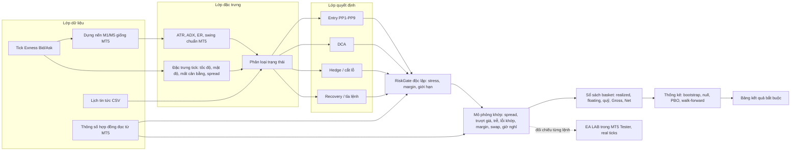
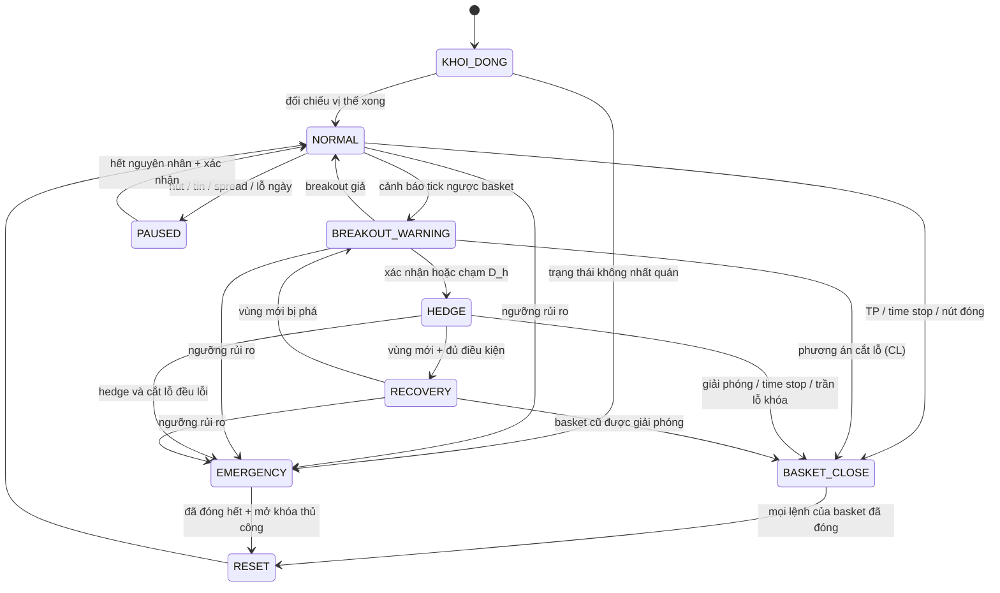

# PHOENIX GRID — Kế hoạch nghiên cứu, kiến trúc và ma trận kiểm định

**DAVID HUNTER – PHOENIX GRID – 0941920986**

| Mục | Giá trị |
|---|---|
| Phiên bản tài liệu | **PG-R0.0**, kế hoạch nghiên cứu |
| Ngày lập | 29/09/2026 |
| Trạng thái | **ĐÃ PHÊ DUYỆT ngày 29/09/2026** (Mục 21). Nội dung được duyệt đóng băng tại commit `47480fe`. Chưa viết EA giao dịch, chưa chạy backtest nào |
| Sản phẩm | XAUUSD trên Exness Standard Cent (XAUUSDc), MetaTrader 5, vốn nghiên cứu 5.000 USC |
| Khung | Giao dịch M1, cấu trúc M5, xử lý tín hiệu theo tick |
| Quan hệ với David Hunter | Dòng sản phẩm **mới, độc lập**. Không đụng tới Baseline V4.52 trong EA-PRO |

Ký hiệu mức độ chắc chắn (giống tài liệu nghiên cứu BTCUSD):

- ✅ **Đo từ dữ liệu có trong repo.** Tái lập được bằng `research/phoenix_grid/thong_ke_mo_ta.py`.
- 🧮 **Ví dụ số học** với giả định nêu rõ. Đây không phải mô phỏng và không phải backtest.
- ❓ **Giả thuyết** cần kiểm định.
- ⛔ **Chưa có dữ liệu** hoặc chưa xác minh.

## Mục lục

| Mục | Nội dung | Kết quả bàn giao (Phần 10) |
|---|---|---|
| 0 | Tóm tắt điều hành | |
| 1 | Nguồn đã đọc và phạm vi | |
| 2 | Phân tích ảnh chiến thuật | |
| 3 | Dữ liệu thực tế định hướng thiết kế | |
| 4 | Kiến trúc hệ thống | |
| 5 | Ký hiệu, đẳng thức kế toán, mô hình chi phí | |
| 6 | Nhận diện trạng thái thị trường | |
| 7 | Phần 1: phương pháp Entry PP1–PP9 | **1. Danh sách phương pháp** |
| 8 | Phần 2: lot đầu tiên, công thức lot và rủi ro, stress | **3. Công thức lot và rủi ro** |
| 9 | Phần 3: DCA | |
| 10 | Phần 4: Hedge | |
| 11 | Phần 5: Recovery và tỉa lệnh | |
| 12 | Phần 6: state machine | **4. Sơ đồ vận hành trạng thái** |
| 13 | Phần 7: kế hoạch backtest và ma trận thử nghiệm | **2. Ma trận thử nghiệm** |
| 14 | Kế hoạch chia dữ liệu | **5. Kế hoạch chia dữ liệu** |
| 15 | Phần 8: bảng kết quả bắt buộc (mẫu) | |
| 16 | Phần 9: tiêu chí nghiệm thu đề xuất | **6. Tiêu chí nghiệm thu** |
| 17 | Dữ liệu và thông số MT5 còn thiếu | **7. Dữ liệu và thông số còn thiếu** |
| 18 | Lộ trình phiên bản nghiên cứu | **8. Kế hoạch triển khai theo phiên bản** |
| 19 | Dashboard Phoenix Grid (thiết kế cho giai đoạn EA) | |
| 20 | Mục tiêu 300–500 USD/tháng: tính khả thi | |
| 21 | Những điểm cần bạn phê duyệt | |

Phụ lục số liệu: [`02_PHU_LUC_THONG_KE_DU_LIEU.md`](02_PHU_LUC_THONG_KE_DU_LIEU.md).

---

## 0. Tóm tắt điều hành

1. **Đây là kế hoạch, chưa phải kết quả.** Tôi chưa chạy backtest nào cho Phoenix Grid. Phép tính duy nhất
   trên dữ liệu thật là **thống kê mô tả** 260.662 nến M1 XAUUSDm (Exness, 31/12/2025 → 27/09/2026) có sẵn
   trong EA-PRO. Mục đích là đặt kịch bản stress và đơn vị tham số.
2. **Ở mức giá năm 2026, vàng chạy ngược 100 USD là chuyện thường ngày, không phải kịch bản hiếm** ✅.
   - Biên độ ngày trung vị là 100,4 USD/oz. 51,6% số ngày có biên độ ≥ 100 USD. Ngày lớn nhất đạt 768 USD.
   - Vào lệnh ở một thời điểm bất kỳ, xác suất giá đi ngược ≥ 100 USD trong 24 giờ là 14–17%, trong 5 ngày là
     39–47%. Mức ngược lớn nhất trong 5 ngày là 1.191 USD.
   - Gap mở cửa đầu tuần có trung vị 14 USD, p90 52 USD, lớn nhất 98 USD.
3. **Chưa có bằng chứng về lợi thế hồi quy về trung bình "vô điều kiện"** ✅. Variance ratio ở khung 5–240 phút
   là 0,91–0,99, nhưng thống kê z* (chịu được phương sai thay đổi) chỉ từ −0,4 đến −1,0, tức không có ý nghĩa
   thống kê. Khi giá gần như bước ngẫu nhiên, DCA/grid **không tạo ra kỳ vọng dương** (định lý dừng tùy chọn).
   DCA chỉ đổi hình dạng phân phối: Win Rate cao hơn, đổi lại lỗ đuôi lớn hơn. Nếu Phoenix Grid có lợi thế, lợi
   thế đó phải đến từ việc **nhận diện đúng vùng sideways và tránh xu hướng**. Đây là giả thuyết trung tâm, phải
   kiểm định đầu tiên (Giai đoạn A0).
4. **Vốn 5.000 USC chỉ đủ cho basket rất nhỏ** 🧮. Giả định H_K (phải xác minh): 0,01 lot XAUUSDc lãi/lỗ 1 USC cho
   mỗi 1 USD/oz.
   - Một lệnh 0,01 lot mất 100 USC (2% tài khoản) khi vàng đi ngược 100 USD. Lệnh 0,10 lot mất 20%.
   - Với ngân sách 1% mỗi basket, basket 3 bậc × 0,01 lot (bước 6 USD) chỉ chịu được **khoảng 22 USD** tính từ
     lệnh đầu. Quá mức đó phải cắt lỗ hoặc hedge.
   - Vì vậy yêu cầu "sống sót khi vàng đi ngược 100 USD" phải được đáp ứng bằng cắt/khóa sớm và SL thảm họa
     phía server. **Không thể đáp ứng bằng cách gồng lệnh.**
5. **Hedge 100% tại mức H cho đúng mức lỗ của việc cắt lỗ tại H ở thời điểm đó**, kể cả spread, nếu cặp lệnh
   được đóng bằng Close By. Khác biệt chỉ đến từ những gì xảy ra sau đó: chi phí giữ lệnh (ví dụ B3 khóa 5 đêm
   tốn khoảng 24% khoản lỗ khóa cho swap), rủi ro khi tháo hedge và phần lãi của chu kỳ Recovery. Vì vậy mọi
   biến thể hedge đều phải so trực tiếp với cắt lỗ có kiểm soát.
6. **Mục tiêu 300–500 USD/tháng trên vốn 50 USD tương đương 600–1.000%/tháng.** Không thể đạt bằng cách tăng lot
   mà không chấp nhận xác suất cháy tài khoản rất cao. Ở mức 5%/tháng (đã là cao), cần vốn khoảng 6.000–10.000 USD.
   Lộ trình hợp lý: chứng minh lợi thế trên vốn nhỏ → forward test → tăng vốn bằng nạp thêm, không tăng rủi ro.
7. **Bài học nội bộ V4.39** (EA-PRO):
   - 6 ứng viên chọn từ 6,5 ngày dữ liệu đều lỗ sau 9 tháng.
   - Tương quan hạng giữa T1–T6 và T7–T9 xấp xỉ 0.
   - Các ví lãi nhất lãi chủ yếu nhờ hai tháng vàng giảm mạnh.

   Vì vậy kế hoạch này: đăng ký trước lưới tham số thô, kiểm định ngẫu nhiên (null), đo PBO, tách riêng
   BUY/SELL, tập TEST chỉ chạy một lần.
8. **Đã duyệt ngày 29/09/2026** (Mục 21). Phoenix Grid chạy trên tài khoản riêng. Việc còn lại là cung cấp dữ
   liệu/thông số ở **Mục 17**, gồm tick XAUUSDc và thông số XAUUSDc. Bước R0.1 đang làm:
   [`03_R01_THONG_SO_VA_DU_LIEU.md`](03_R01_THONG_SO_VA_DU_LIEU.md).

---

## 1. Nguồn đã đọc và phạm vi

| Nguồn | Nội dung dùng cho kế hoạch |
|---|---|
| `EA-PRO/AGENTS.md`, `EA-PRO/README.md` | Quy chuẩn phiên bản (TEST / LIVE_REAL / BASELINE), không sửa Baseline, không tự nhận đã compile, mẫu nhật ký phiên bản. Baseline V4.52 đang chạy thật trên **XAUUSDc, Magic 68999** |
| `EA-PRO/data/backtest_mt5/2026-09-29_V439_7PP_KiemChung_6PP/` | Nến M1 XAUUSDm 9 tháng kèm spread. Thông số XAUUSDm: tick 0,001; lot min/bước 0,01; swap BUY −560 point, SELL 0; thứ Tư ×3 |
| `EA-PRO/data/tick/XAUUSDm_2026-01-01_2026-04-30/` | Tick Bid/Ask Exness, mới có phần 1/15 (01–12/01/2026) |
| Repo này, nhánh `claude/vibrant-turing-8b1e1v` | Báo cáo kiểm chứng MT5 9 tháng của V4.39. Bộ công cụ Python theo tick đã đối chiếu 164/164 lệnh với MT5. Có thể tái sử dụng phần đọc tick (`dh/data.py`) và chỉ báo chuẩn MT5 (`dh/mt5ind.py`) |
| Ảnh "DAVID HUNTER – PHOENIX GRID" | Chu trình 6 bước và bố cục dashboard (Mục 2) |

- Không dùng mã nguồn EA cũ.
- Các file BTCUSDc ở thư mục gốc repo này thuộc dự án BTC, không dùng cho XAUUSD.

**Nguyên tắc vốn áp dụng** (theo kỹ năng EA David Hunter):

- Rủi ro dự kiến tối đa 1% mỗi vị thế.
- Lỗ ngày tối đa 10% vốn đầu ngày, tính cả lãi/lỗ thả nổi.
- Không DCA/martingale không giới hạn.
- Có bảo vệ khi mất kết nối hoặc khởi động lại.

**Cách hiểu đề xuất cho Phoenix Grid (cần duyệt):** "vị thế" = cả basket. Lỗ dự kiến của basket tại mức phòng thủ
(cắt lỗ hoặc hedge) ≤ 1% vốn tham chiếu.

---

## 2. Phân tích ảnh chiến thuật

### 2.1. Chu trình

| Bước trong ảnh | Ý nghĩa | Trạng thái EA (Mục 12) |
|---|---|---|
| 1. Sideways – tìm cơ hội | Vào lệnh khi thị trường đi ngang | NORMAL |
| 2. DCA – thông minh | Thêm lệnh có điều kiện khi giá đi ngược | NORMAL (bậc DCA) |
| 3. Breakout – cảnh báo sớm | Phát hiện giá phá vùng theo tick | BREAKOUT_WARNING |
| 4. Hedge – cân bằng vị thế | Khóa Net Exposure | HEDGE |
| 5. Giao dịch vùng mới & tỉa lệnh – tối ưu lợi nhuận | Chu kỳ mới trong vùng giá mới, đồng thời giảm dần basket cũ | RECOVERY |
| 6. Chu kỳ mới – bắt đầu lại | Đóng basket, reset | BASKET_CLOSE → RESET |

Khi không có breakout, EA đi nhánh ngắn: 1 → 2 → chốt basket → 6 → 1.

### 2.2. Năm giả định ngầm của sơ đồ ❓

Cả năm giả định dưới đây đều là giả thuyết, cần kiểm định trước khi dùng.

| Mã | Giả định trong ảnh | Kiểm định ở |
|---|---|---|
| H-A | Có thể nhận diện sideways **trước** (không chỉ khi nhìn lại), và vùng đó có xu hướng được giữ | A0 |
| H-B | DCA "thông minh" cải thiện kỳ vọng sau khi đã điều chỉnh rủi ro, không chỉ tăng Win Rate | C |
| H-C | Cảnh báo theo tick đến đủ sớm để phòng thủ với lỗ nhỏ, và báo động giả không quá tốn kém | D1 |
| H-D | Hedge + Recovery + tỉa lệnh giải phóng basket cũ với chi phí thấp hơn "cắt lỗ và bắt đầu lại" | D, E |
| H-E | Chu kỳ lặp lại được qua nhiều giai đoạn thị trường, kể cả khi breakout liên tiếp | F, G |

### 2.3. Những điểm chưa nhất quán trong số liệu của ảnh

Các điểm này sẽ được sửa ở dashboard thật.

1. **Dấu P&L basket cũ.** Ảnh ghi "+186.45" màu đỏ, "P&L chu kỳ mới +209.90", "P&L tổng +23.45". Ba số chỉ khớp
   nếu basket cũ là **−186,45** (−186,45 + 209,90 = 23,45). Dashboard thật lấy dấu và màu từ cùng một giá trị.
2. **Floating P&L +123.45** (Equity 5.123,45 − Balance 5.000) khác **P&L hiện tại tổng +23.45** trong bảng vị thế.
   Dashboard thật chỉ dùng một nguồn: Floating = Σ(profit + swap) của vị thế. Nếu tài khoản có EA khác, tách
   thành "Floating tài khoản" và "Floating Phoenix Grid".
3. **Đơn vị tiền.** Ảnh dùng "$" (ví dụ "Chi phí 1 lot $12.00"), nhưng tài khoản Cent tính bằng **USC**.
   Dashboard ghi đúng ACCOUNT_CURRENCY, có thể kèm quy đổi USD.
4. **Quy mô vị thế.** Ảnh có BUY 0,42 + SELL 0,42 lot (Gross 0,84) trên 5.000 USC. Theo H_K, chỉ cần một chân
   0,42 lot mất cân bằng thì vàng đi 100 USD = 4.200 USC (84% tài khoản). Con số này không tương thích với ngân
   sách rủi ro. "Khối lượng tối đa 5.00" cũng vậy: giới hạn phải do bộ rủi ro tính, không phải hằng số.
5. **Giá vốn TB.** BUY 2.632,15 / SELL 2.634,82 với 0,42 lot mỗi bên cho phần chênh khóa ≈ +112 USC (theo H_K),
   không khớp "+23.45".
6. **Spread "12 (1.2)"** chưa rõ đơn vị. Dashboard sẽ ghi spread theo point và theo USD/oz.
7. **Mức giá 2.630** là vùng giá cuối 2024. Năm 2026 vàng ở khoảng 4.000–5.400 USD, ATR M5 trung vị 5,24 USD,
   biên độ ngày trung vị 100 USD. Hộp giá 6,30 USD trong ảnh ≈ 1,2 × ATR M5 hiện tại, dùng được làm ví dụ bố
   cục nhưng không dùng làm tham số.
8. **Kích thước ảnh 1355 × 1161 px** lớn hơn cửa sổ chart phổ biến trên VPS (1366 × 768). Cần chế độ thu gọn
   và tỷ lệ hiển thị.

---

## 3. Dữ liệu thực tế định hướng thiết kế ✅

Nguồn: `nen_M1.csv` (XAUUSDm, 231 ngày có giao dịch). Chi tiết và cách tính ở Phụ lục.

| Chỉ số | Giá trị | Hệ quả thiết kế |
|---|---|---|
| Biên độ ngày | Trung vị 100,4; p90 205,9; max 768,4 USD/oz | Stress 100 USD chỉ là "một ngày bình thường". Stress phải có cả 200–300 USD và gap |
| Ngược chiều ≥ 20 USD | 1 giờ: 14–16%. 4 giờ: 39–42%. 24 giờ: 69–71% | Basket có biên phòng thủ khoảng 20 USD sẽ chạm phòng thủ rất thường xuyên nếu giữ lâu → phải chốt nhanh |
| Ngược chiều ≥ 100 USD | 24 giờ: 14–17%. 3 ngày: 30–36%. 5 ngày: 39–47% | Giữ basket nhiều ngày gần như chắc chắn gặp 100 USD → time stop là bắt buộc |
| Gap đầu tuần | Trung vị 14; p90 52; max 98 USD/oz | Đề xuất không mang exposure chưa hedge qua cuối tuần |
| ATR14 trung vị | M1 2,24; M5 5,24; M15 9,36; H1 19,72 USD/oz | Mọi khoảng cách tham số hóa theo ATR, không theo USD cố định |
| Spread (cột spread của nến M1, nhiều khả năng là spread nhỏ nhất trong phút, xem R0.1) | Trung vị 0,26; p99 0,364; max 1,44 USD/oz. Cao hơn quanh giờ mở lại 22:00–23:00 | Spread = 11,6% ATR M1, nên scalp TP nhỏ rất nhạy chi phí. Đây là cận dưới; cần đo spread theo tick của tài khoản Cent |
| Giờ nghỉ hằng ngày | Nến cuối trước nghỉ lúc 20:57 (113 lần) hoặc 21:57 (34 lần). Mở lại 22:00–22:01 hoặc 23:00–23:01 giờ server | Không vào lệnh sát giờ nghỉ. Trong giờ nghỉ, hedge không thể khớp |
| Variance ratio 5–240 phút | 0,91–0,99; z* từ −0,43 đến −1,04 | Không có hồi quy về trung bình vô điều kiện có ý nghĩa → lợi thế phải đến từ lọc trạng thái |
| Theo tháng | Xác suất ngược ≥ 100 USD trong 24 giờ dao động 4%–35% tùy tháng và hướng | Kết quả phụ thuộc mạnh vào giai đoạn → bắt buộc kiểm định nhiều giai đoạn |

**Giới hạn của các số liệu trên:**

- Cột spread của nến M1 không phải spread tại từng tick. Đối chiếu ở R0.1 cho thấy nó nhiều khả năng là spread nhỏ
  nhất trong phút, tức cận dưới của spread thật.
- Dữ liệu là XAUUSDm (tài khoản Standard, tiền USD), không phải XAUUSDc.
- Dữ liệu 2026 đã được dùng ở đây để đặt kịch bản stress và đã được dự án V4.39 xem. **Không** tham số tín hiệu nào
  của Phoenix Grid được chọn từ các thống kê này (xem Mục 14 về tập TEST).

---

## 4. Kiến trúc hệ thống

### 4.1. Hai hệ thống tách biệt

1. **Hệ thống nghiên cứu.** Làm trước, sau khi bạn duyệt. Gồm bộ mô phỏng theo tick bằng Python và EA LAB chỉ
   chạy trong Strategy Tester để đối chiếu. Mục tiêu: trả lời H-A…H-E bằng số liệu.
2. **EA giao dịch Phoenix Grid.** Chỉ làm sau khi nghiên cứu đạt tiêu chí và được duyệt. EA chỉ chứa các module
   đã được duyệt.

### 4.2. Hệ thống nghiên cứu



| Lớp | Thành phần | Ghi chú |
|---|---|---|
| Dữ liệu | Đọc tick zip (tái sử dụng `dh/data.py`), dựng nến M1/M5 theo Bid như MT5, nạp thông số hợp đồng, lịch tin | Kiểm tra thiếu dữ liệu, gap, giờ nghỉ |
| Đặc trưng | ATR/ADX/EMA đúng công thức MT5 (tái sử dụng `dh/mt5ind.py`), ER, swing, hộp giá, đặc trưng tick | Chỉ dùng thông tin đã có tại thời điểm quyết định, không nhìn tương lai |
| Trạng thái | Bộ phân loại, kèm nhãn hậu nghiệm để đánh giá | Giai đoạn A0 |
| Quyết định | Entry PP1–PP9, DCA, Hedge/cắt lỗ, Recovery/tỉa | Mỗi module bật/tắt độc lập để làm ablation |
| RiskGate | Stress trước lệnh, margin, giới hạn, dự trữ margin phòng thủ | Độc lập với module quyết định. Mọi lệnh phải qua đây |
| Khớp lệnh | Bid/Ask thật, trượt giá, độ trễ, lỗi khớp / khớp một phần, spread giãn, margin và hedged margin, swap (thứ Tư ×3), giờ nghỉ | Các tham số lỗi dùng để stress |
| Sổ sách | Theo basket: realized/floating, quỹ Recovery Π, Gross/Net, lỗ khóa | Kiểm tra đẳng thức kế toán (Mục 5) sau mỗi sự kiện |
| Thống kê | Chỉ số bắt buộc, bootstrap theo ngày, null tournament, PBO, walk-forward | Xuất bảng kết quả ở Mục 15 |
| Đối chiếu MT5 | EA LAB (không có công tắc giao dịch thật), chế độ "Every tick based on real ticks" | Tiêu chí NT-29 |

### 4.3. EA giao dịch (tương lai): cấu trúc đề xuất để duyệt trước

Phần này chưa lập trình. Mục đích là để bạn duyệt cấu trúc trước.

| Module | Trách nhiệm |
|---|---|
| `Config` | Input tiếng Việt có dấu (tên biến ASCII, nhãn là chú thích `//` và `input group` tiếng Việt; file lưu UTF-8 để giữ dấu) |
| `SymbolSpec` | Đọc thông số hợp đồng, chuẩn hóa khối lượng theo bước lot, tính VPP/margin bằng `OrderCalcProfit` / `OrderCalcMargin` |
| `MarketData` | Bộ đệm tick vòng, thống kê spread, nến M1/M5, handle chỉ báo |
| `RegimeDetector` + `RangeBox` | Trạng thái thị trường và hộp giá (Mục 6) |
| `SignalEngine` | Entry của các PP đã duyệt |
| `DCAEngine`, `HedgeEngine`, `RecoveryEngine`, `TrimEngine` | Quyết định theo Mục 9–11 |
| `RiskGate` | Kiểm tra trước lệnh (Mục 8.2), độc lập. Không module nào gửi lệnh trực tiếp |
| `Execution` | Gửi lệnh, xác nhận khối lượng thực khớp, phân loại lỗi (tạm thời / thị trường đóng / chưa rõ kết quả → đối chiếu / nghiêm trọng), Close By |
| `BasketRegistry` + `Accounting` | Ánh xạ ticket → basket, realized/floating từng basket, quỹ Π |
| `StateMachine` | Mục 12 |
| `Persistence` + `Log` | File trạng thái (ghi file tạm rồi đổi tên để không hỏng), CSV sự kiện/lệnh/basket theo tháng |
| `Dashboard` | Mục 19. Chỉ chạy trên `OnTimer` |

**Luồng sự kiện:**

- `OnTick`: cập nhật tick, cảnh báo breakout, phòng thủ, TP basket, kiểm tra khẩn cấp. Không vẽ giao diện.
- Khi có nến M1/M5 mới: tính cấu trúc, trạng thái, tín hiệu Entry/DCA.
- `OnTimer` (1 giây): dashboard, ghi trạng thái.
- `OnTradeTransaction`: xác nhận khớp, cập nhật sổ sách.
- `OnChartEvent`: nút điều khiển.

**Nguyên tắc:**

- Magic riêng, khác 68999 của David Hunter.
- Comment lệnh dạng `PG|B<basket>|<vai trò><bậc>` chỉ là nguồn dự phòng, vì sàn có thể ghi đè comment. Nguồn chính
  là bảng ticket → basket lưu trong file.
- SL thảm họa phía server cho phần exposure chưa hedge, để bảo vệ khi VPS/EA mất kết nối.
- **Tài khoản riêng** cho Phoenix Grid (đã chốt ngày 29/09/2026).
  - RiskGate vẫn tính theo margin và Equity của toàn tài khoản, vì stop out áp dụng cho cả tài khoản.
  - Đề xuất (hệ quả của tài khoản riêng, sẽ trình duyệt khi viết EA): mọi vị thế hoặc lệnh chờ không thuộc Phoenix
    Grid (Magic khác, lệnh tay) được coi là bất thường → chuyển PAUSED và cảnh báo.

---

## 5. Ký hiệu, đẳng thức kế toán, mô hình chi phí

| Ký hiệu | Ý nghĩa | Nguồn |
|---|---|---|
| b, a, s | Bid, Ask, spread = a − b | Tick |
| m | Giá giữa = (a + b)/2 | Tick |
| ATR1, ATR5 | ATR(14) khung M1, M5, tính trên nến đã đóng | iATR |
| VPP | Tiền tài khoản khi 1 lot đi 1 USD/oz = TICK_VALUE_LOSS / TICK_SIZE | MT5 ⛔ |
| K | K = 0,01 × VPP (0,01 lot, 1 USD/oz). **Giả định làm việc H_K: K = 1 USC**, tức VPP = 100 USC | MT5 ⛔ |
| V_min, V_step | Lot tối thiểu, bước lot | MT5 |
| σ_i, V_i, P_i | Hướng (+1 BUY, −1 SELL), khối lượng, giá mở của vị thế i | — |
| N, G | Net exposure = Σ σ_i V_i. Gross = Σ V_i | — |
| B, F, E | Balance; Floating (profit + swap của vị thế mở); Equity = B + F | MT5 |
| E_ref | Vốn tham chiếu để tính lot (Mục 8.6) | — |
| R_b | Ngân sách rủi ro mỗi basket = r_b × E_ref | — |
| d_k, w_k | Khoảng cách từ bậc k tới lệnh đầu (theo hướng bất lợi); hệ số khối lượng của bậc k | — |
| D_h, D_stop | Khoảng cách từ lệnh đầu tới mức hedge; tới mức cắt cứng | — |
| c_rt | Chi phí khứ hồi mỗi lot = VPP × (s + 2 × trượt) + commission | — |
| U, L, W, M | Biên trên, biên dưới, độ rộng, điểm giữa của hộp giá M5 | — |
| Π | Quỹ Recovery: lợi nhuận đã chốt của chu kỳ mới, dành để giải phóng basket cũ | — |

Mọi con số 🧮 trong tài liệu tỷ lệ tuyến tính với K. Nếu K thật khác 1 USC, nhân các con số tiền với K thật.

**Đẳng thức kế toán.** Đây là cơ sở để không nhầm "chuyển lỗ" với "tạo lãi".

```
E = B + F
Đóng vị thế i tại giá hiện tại:  ΔB = +f_i,  ΔF = −f_i  ⇒  ΔE ≈ 0 (chỉ trừ commission đóng lệnh, nếu có)

⇒ Tỉa lệnh, đóng cặp, chốt lỗ… KHÔNG làm tăng Equity.
   Equity chỉ tăng khi giá đi có lợi cho Net exposure, hoặc khi lệnh mới có lãi.

Cặp khóa (BUY V tại P_b, SELL V tại P_s), định giá tại thời điểm t:
  f_cặp = V × VPP × (P_s − P_b − s_t) + swap
  → Không phụ thuộc giá, nhưng phụ thuộc spread hiện tại s_t.
    Khi spread giãn (giờ mở lại, tin tức), Equity của cặp khóa giảm tạm thời.
    Vì vậy mọi ngưỡng DD tính theo Equity phải lọc spread đột biến.
  Đóng bằng Close By: realized = V × VPP × (P_s − P_b). Không trả thêm spread.
```

**Mô hình chi phí:**

```
Chi phí vào + ra mỗi lot    c_rt = VPP × (s + 2 × trượt) + commission khứ hồi
Swap mỗi đêm mỗi lot        = swap_point × point × VPP × hệ số ngày   (XAUUSDm: thứ Tư ×3; phải xác minh với XAUUSDc)
Lãi ròng basket             = Σ(profit + swap) − commission − dự phòng trượt khi đóng
TP basket BUY (theo Bid)    b_TP = P_avg + (TP_ròng + C_đóng) / (V_tổng × VPP)
Giá vốn sau DCA             P_avg' = (Σ V_i × P_i + V_new × P_new) / (Σ V_i + V_new)
Win Rate hòa vốn            WR_hv = (SL + C) / (TP + SL)        (TP, SL, C tính theo USD/oz)
```

Ví dụ WR hòa vốn: TP = 2, SL = 5, C = 0,36 USD/oz cho WR_hv = 76,6%. Scalp chốt nhỏ nhưng cắt lỗ rộng cần Win Rate rất
cao chỉ để hòa vốn.

**Hedge và cắt lỗ tại cùng một mức cho cùng kết quả** (bỏ qua swap):

- Mua ở m0 + s/2, giá giữa về m1.
- Cắt lỗ: bán đóng ở m1 − s/2 → kết quả (m1 − m0) − s.
- Hedge: bán ở m1 − s/2 rồi Close By → kết quả (m1 − m0) − s.

Hai kết quả bằng nhau.

---

## 6. Nhận diện trạng thái thị trường

Nguyên tắc: không dùng một chỉ báo duy nhất. Kết hợp cấu trúc giá (hộp, swing), ATR, ADX, động lượng (ER, độ dốc)
và dữ liệu tick.

```
Hộp giá trên N_box nến M5 đã đóng:  U = max(High), L = min(Low), W = U − L, M = (U + L)/2
ER_N    = |C_1 − C_{N+1}| / Σ_{i=1..N} |C_i − C_{i+1}|          (Kaufman efficiency ratio)
β_N     = độ dốc hồi quy của Close trên N nến ÷ ATR5              (số ATR mỗi nến)
Chạm    t_U = số đỉnh swing có High ≥ U − τW ;  t_L = số đáy swing có Low ≤ L + τW
Tick    v_Δ = (m_t − m_{t−Δ}) / ATR1
        λ_Δ = số tick trong Δ ÷ trung vị 60 phút
        I_K = (số tick tăng − số tick giảm) ÷ tổng, trên K lần đổi giá
        ŝ   = s ÷ trung vị spread 30 phút

SIDEWAYS        w_min ≤ W/ATR5 ≤ w_max  VÀ  ADX5 < a_side  VÀ  ER_N < e_side
                VÀ  t_U ≥ 2  VÀ  t_L ≥ 2  VÀ  |β_N| < β_side
TREND_UP        ADX5 ≥ a_trend  VÀ  DI+ > DI−  VÀ  ER_N ≥ e_trend  VÀ  β_N ≥ β_t
TREND_DOWN      ADX5 ≥ a_trend  VÀ  DI− > DI+  VÀ  ER_N ≥ e_trend  VÀ  β_N ≤ −β_t
BREAKOUT_WARN↑  (b ≥ U + b_w × ATR5)  HOẶC  (b > U  VÀ  v_Δ ≥ v_w  VÀ  λ_Δ ≥ λ_w)          — theo tick
BREAKOUT_CONF↑  (nến M1 đóng ≥ U + b_c × ATR5)  HOẶC  (b ≥ U + b_x × ATR5)
                HOẶC  (b > U liên tục T_c giây)
BREAKOUT GIẢ↑   sau WARN/CONF, b ≤ U − r_f × W trong vòng T_f phút
VÙNG MỚI        sau CONF: hộp mới thỏa điều kiện SIDEWAYS trên cửa sổ ≥ N_min nến kể từ breakout,
                |M_mới − M_cũ| ≥ 0,5 × W_cũ,  ADX5 đã giảm ≥ Δ_adx từ đỉnh sau breakout
KHÔNG GIAO DỊCH thiếu dữ liệu, ŝ > ŝ_max, cửa sổ tin tức, sát giờ nghỉ/cuối tuần,
                mất tick > 60 giây trong phiên
(Chiều ↓ đối xứng.)
```

**Chống nhấp nháy.** Trạng thái cấu trúc (SIDEWAYS/TREND/VÙNG MỚI) chỉ đổi khi điều kiện đúng h_in nến M5 liên tiếp,
và chỉ thoát khi sai h_out nến liên tiếp. Cảnh báo breakout theo tick không có trễ, vì mục đích của nó là phản ứng sớm.

**Đánh giá bộ phân loại (Giai đoạn A0).** Đánh giá trước khi gắn vào bất kỳ chiến lược nào.

- Nhãn hậu nghiệm cho SIDEWAYS tại thời điểm t: "đúng" nếu trong 60 phút sau đó giá nằm trong [L − 0,5 × ATR5,
  U + 0,5 × ATR5].
- Nhãn hậu nghiệm cho cảnh báo breakout: "đúng" nếu sau cảnh báo giá đi thêm ≥ 2 × ATR5 theo hướng phá trước khi
  quay về M.
- Lead time: thời gian từ lúc cảnh báo tới lúc giá đi hết 1 × ATR5 ngoài biên.
- So với tỷ lệ nền: cửa sổ ngẫu nhiên có cùng độ rộng hộp. Bộ phân loại chỉ có giá trị nếu thêm được thông tin
  so với tỷ lệ nền (ngưỡng ở NT-A0, Mục 16).

---

## 7. Phần 1 — Phương pháp Entry PP1–PP9 (kết quả bàn giao 1)

### 7.1. Quy trình chung cho mọi phương pháp

1. **Kiểm định độc lập từng phương pháp dưới dạng lệnh đơn**: SL/TP chuẩn hóa theo ATR, có time stop, lot cố định
   0,01, **không DCA, không hedge**. Nếu Entry không có lợi thế ở dạng lệnh đơn, DCA không tạo ra lợi thế. DCA chỉ
   dời lỗ ra phần đuôi của phân phối.
2. **Báo cáo riêng** BUY/SELL và từng phiên (Á 0–8, Âu 8–16, Mỹ 16–24 giờ server, giống V4.39). Mục đích là tránh
   "lãi nhờ trôi giá": V4.39 có các ví chỉ SELL lãi nhờ hai tháng vàng giảm mạnh.
3. **Chi phí thật**: Bid/Ask từ tick; trượt giá ∈ {0; 0,5 × spread trung vị}; độ trễ ∈ {0; 250; 500 ms}.
4. **Lợi thế sau chi phí** được đo bằng:
   - expectancy (USC/lệnh) kèm khoảng tin cậy 95% (bootstrap theo khối ngày);
   - PF;
   - so với **mô hình null**: vào lệnh ngẫu nhiên với cùng phân phối trạng thái/phiên, cùng số lệnh, cùng quy tắc
     thoát;
   - độ nhạy chi phí;
   - độ ổn định theo tháng/quý.
5. **Lưới tham số thô, đăng ký trước**: mỗi tham số 2–3 giá trị, tối đa 48 biến thể mỗi phương pháp (Mục 7.2).
   Không mở rộng lưới sau khi thấy kết quả. Muốn thêm biến thể thì phải ra phiên bản kế hoạch mới.
6. **Chi phí tối đa**:
   - Phương pháp scalp (PP1, PP2, PP4): TP ≥ 5 × c_rt.
   - Phương pháp khác: c_rt ≤ 10% khoảng SL.
   - Chỉ vào lệnh khi s ≤ min(s_abs, 1,5 × trung vị 30 phút). s_abs lấy theo p99 spread của tài khoản Cent (tham
     chiếu XAUUSDm: 0,364 USD/oz).
   - Với spread 0,26 và trượt 0,05 mỗi chiều: c_rt ≈ 0,36 USD/oz, nên TP tối thiểu cho scalp ≈ 1,8 USD/oz
     (≈ 0,8 × ATR1 trung vị).
7. **Tiền nghiệm từ V4.39** được coi là bằng chứng tham khảo, không phải quy tắc:
   - PIN và LQ lỗ ở gần như mọi input.
   - BUY trong phiên Á/Âu âm ở cả 6 phương pháp.
8. **Không tự động kết hợp.** Chỉ kết hợp các PP đã qua cổng A và được duyệt. Cách kết hợp duy nhất được đề xuất là
   **định tuyến theo trạng thái**: SIDEWAYS → PP sideways; vùng mới → PP đã duyệt cho vùng mới. Không bỏ phiếu
   nhiều chỉ báo.

### 7.2. Chín phương pháp

#### PP1 — Scalp trong vùng sideways

| Hạng mục | Nội dung |
|---|---|
| Ý tưởng | Mua gần biên dưới, bán gần biên trên của hộp M5, chốt nhanh |
| BUY | Đang SIDEWAYS và b ≤ L + z × W. Xác nhận theo biến thể: (a) không xác nhận; (b) nến M1 từ chối (đóng cửa ≥ đáy + 0,6 × biên độ nến); (c) tick hết đà: abs(v_15s) < v_fade sau nhịp giảm |
| SELL | Đối xứng tại a ≥ U − z × W |
| Không giao dịch | Không SIDEWAYS; đang có cảnh báo breakout; W/ATR5 < w_min; khoảng tới M < 5 × c_rt; lọc spread/tin/giờ nghỉ |
| Thoát | TP = min(k_tp × ATR1; khoảng tới M). SL = L − 0,5 × ATR5 (hộp bị phá). Time stop 60 phút |
| Chi phí tối đa | TP ≥ 5 × c_rt |
| Trạng thái phù hợp | SIDEWAYS |
| Rủi ro khi đổi trạng thái | Breakout ngược chiều → chạm SL. Trong Phoenix Grid, đây là thời điểm chuyển sang DCA/phòng thủ |
| Lưới đăng ký trước | z ∈ {0,15; 0,25; 0,35} × xác nhận {a; b; c} × k_tp ∈ {0,5; 1,0; 1,5} = **27** |
| Kiểm định riêng | So với vào lệnh ngẫu nhiên **trong SIDEWAYS**, cùng quy tắc thoát. Cách này tách lợi thế "vị trí trong hộp" khỏi lợi thế "trạng thái" |
| Vai trò trong Phoenix Grid | Ứng viên chính cho lệnh đầu basket và cho chu kỳ vùng mới |

#### PP2 — Mean Reversion theo vùng giá (độ lệch thống kê)

| Hạng mục | Nội dung |
|---|---|
| Ý tưởng | Giá lệch xa trung bình động (tính theo độ lệch chuẩn) có xu hướng quay về. Không cần hộp giá |
| Chỉ số | z_t = (m_t − EMA_n) / σ_n, trên M1 |
| BUY | z_t ≤ −z_e và trạng thái không phải TREND_DOWN hay BREAKOUT↓ |
| SELL | z_t ≥ z_e và trạng thái không phải TREND_UP hay BREAKOUT↑ |
| Không giao dịch | ADX5 ≥ a_trend; tick momentum cùng chiều độ lệch còn mạnh (abs(v) ≥ v_w); lọc spread/tin |
| Thoát | z về 0 (hoặc 0,5 × z_e). SL 1,5 × ATR5. Time stop 90 phút |
| Chi phí tối đa | Khoảng cách tới EMA ≥ 5 × c_rt |
| Trạng thái phù hợp | SIDEWAYS, xu hướng yếu |
| Rủi ro khi đổi trạng thái | Trong xu hướng, độ lệch kéo dài → SL liên tiếp. Bộ lọc trạng thái là yếu tố quyết định |
| Lưới đăng ký trước | n ∈ {30; 60; 120} × z_e ∈ {2,0; 2,5; 3,0} × thoát ∈ {z = 0; z = 0,5 × z_e} = **18** |
| Vai trò | Thay thế hoặc bổ sung PP1 khi không có hộp giá rõ |

#### PP3 — Price Action và cấu trúc M1/M5

| Hạng mục | Nội dung |
|---|---|
| Ý tưởng | Giá quét đỉnh/đáy swing M5, sau đó cấu trúc M1 đổi chiều (CHoCH) → vào lệnh đảo chiều |
| BUY | Giá phá đáy swing M5 ít nhất d_sw × ATR5, rồi trong T_ch nến M1 có nến đóng trên đỉnh swing M1 gần nhất |
| SELL | Đối xứng |
| Không giao dịch | Xu hướng mạnh cùng chiều quét (ADX5 ≥ a_trend và DI cùng chiều); lọc spread/tin |
| Thoát | SL dưới đáy quét − 0,2 × ATR5. TP 1,5R. Time stop 120 phút |
| Chi phí tối đa | c_rt ≤ 10% SL |
| Trạng thái phù hợp | Biên hộp sideways, cuối nhịp |
| Rủi ro khi đổi trạng thái | Cú quét thực chất là khởi đầu breakout thật |
| Lưới đăng ký trước | swing k ∈ {2; 3} × d_sw ∈ {0,1; 0,25} × T_ch ∈ {5; 10; 20} = **12** |
| Tiền nghiệm | V4.39: LQ (quét thanh khoản) và PIN lỗ ở gần như mọi input → xác suất thành công thấp. Chỉ giữ nếu vượt null rõ ràng |

#### PP4 — Momentum theo tick

| Hạng mục | Nội dung |
|---|---|
| Ý tưởng | Cụm tick tăng tốc, dày đặc, cùng chiều thường tiếp diễn trong ngắn hạn |
| BUY | v_Δ ≥ v_e VÀ λ_Δ ≥ λ_e VÀ I_K ≥ i_e VÀ ŝ ≤ 1,2 |
| SELL | Đối xứng |
| Không giao dịch | Spread giãn; ngay sau giờ mở lại; cửa sổ tin (trừ khi nghiên cứu riêng); trong 60 giây sau lệnh trước cùng chiều |
| Thoát | Sau H giây, hoặc TP = 1 × ATR1 / SL = 1 × ATR1 |
| Chi phí tối đa | TP ≥ 5 × c_rt, và vẫn phải có lãi khi trễ 500 ms |
| Trạng thái phù hợp | Khởi đầu breakout, xu hướng |
| Rủi ro khi đổi trạng thái | Trong sideways có nhiều cụm tick giả. Trễ khớp lệnh có thể ăn hết lợi thế |
| Lưới đăng ký trước | Δ ∈ {5; 15; 30} giây × v_e ∈ {0,5; 1,0; 1,5} ATR1 × λ_e ∈ {1,5; 2,5} × thoát ∈ {H = 120 giây; TP/SL} = **36** |
| Vai trò | Chủ yếu làm **bộ cảnh báo breakout** (Mục 6, thử nghiệm D1). Chỉ dùng làm Entry nếu vẫn vượt null sau khi tính trễ |

#### PP5 — Breakout và xác nhận breakout

| Hạng mục | Nội dung |
|---|---|
| Ý tưởng | Giá thoát khỏi hộp sideways kèm biến động tăng thì đi tiếp |
| BUY | Từ SIDEWAYS, nến M1 đóng ≥ U + b_c × ATR5. Biến thể có xác nhận biến động: thêm điều kiện ATR1(5)/ATR1(60) ≥ 1,3 |
| SELL | Đối xứng |
| Không giao dịch | W < w_min × ATR5; sát giờ nghỉ; spread giãn |
| Thoát | SL = M (hoặc U − 0,5 × ATR5). TP = U + k_W × W. Time stop 120 phút |
| Chi phí tối đa | c_rt ≤ 10% SL |
| Trạng thái phù hợp | Chuyển từ SIDEWAYS sang TREND |
| Rủi ro khi đổi trạng thái | Breakout giả. Tỷ lệ breakout giả được đo theo giờ và phiên |
| Lưới đăng ký trước | N_box ∈ {24; 48} × b_c ∈ {0,1; 0,3; 0,5} × xác nhận biến động {không; có} × SL {M; U − 0,5 ATR5} × k_W ∈ {1; 2} = **48** |
| Vai trò | Đo chất lượng breakout cho phần phòng thủ. Lệnh thuận chiều breakout có thể là nguồn lãi cho Recovery (nếu được duyệt) |

#### PP6 — Pullback sau breakout

| Hạng mục | Nội dung |
|---|---|
| Ý tưởng | Sau breakout, giá quay lại kiểm tra biên vừa phá rồi đi tiếp |
| BUY | Sau BREAKOUT_CONF↑, trong T_pb phút giá quay về [U − δ × ATR5; U + δ × ATR5] và có tín hiệu từ chối (nến M1 đóng tăng, hoặc tick hết đà giảm). Chưa có nến M1 nào đóng dưới U − 0,5 × ATR5 |
| SELL | Đối xứng |
| Không giao dịch | Đã quá T_pb; breakout đã bị đánh giá là giả |
| Thoát | SL = đáy nhịp hồi − 0,3 × ATR5. TP = đỉnh breakout + 0,5 × W, hoặc 2R |
| Chi phí tối đa | c_rt ≤ 10% SL |
| Trạng thái phù hợp | Đầu xu hướng |
| Rủi ro khi đổi trạng thái | Retest thất bại, tức breakout giả |
| Lưới đăng ký trước | δ ∈ {0,2; 0,5} × T_pb ∈ {10; 30; 60} phút × xác nhận {nến M1; tick} = **12** |
| Vai trò | Ứng viên giao dịch thuận chiều trong vùng mới (Recovery) |

#### PP7 — Giao dịch theo hỗ trợ/kháng cự

| Hạng mục | Nội dung |
|---|---|
| Mức giá | (a) cụm swing M15 (≥ 2 lần chạm trong τ × ATR5); (b) PDH/PDL; (c) biên phiên Á; (d) số tròn 10/50 USD. Mỗi loại kiểm định riêng |
| BUY / SELL, chế độ bật lại | Lần chạm đầu tiên kèm tín hiệu từ chối → vào ngược chiều. SL = mức ± 0,5 × ATR5. TP = mức kế tiếp, hoặc 1,5R |
| BUY / SELL, chế độ phá–retest | Như PP6, áp cho mức S/R |
| Không giao dịch | Xu hướng mạnh hướng vào mức; mức đã bị chạm ≥ 3 lần (dễ vỡ) |
| Chi phí tối đa | c_rt ≤ 10% SL |
| Rủi ro khi đổi trạng thái | Mức bị phá trong xu hướng |
| Lưới đăng ký trước | 4 loại mức × 2 chế độ × τ ∈ {0,2; 0,4} = **16** |
| Vai trò | Cung cấp "vùng kỹ thuật" cho DCA-3 và cho tháo hedge (TH-1) |

#### PP8 — Kết hợp ATR, ADX và biến động

| Hạng mục | Nội dung |
|---|---|
| 8a. Nén → nổ | ATR1(5)/ATR1(60) ≤ c_low VÀ độ rộng Bollinger(20) M5 ở phân vị ≤ p_bb → vào theo hướng phá hộp nén. SL ở cạnh đối diện. TP = 2 × độ rộng hộp |
| 8b. Kiệt sức | Giá đi ≥ k_x × ATR5 trong ≤ N nến M5, ADX5 ≥ 30 và bắt đầu giảm, tick hết đà → vào ngược về trung bình. SL vượt cực trị + 0,3 × ATR5 |
| 8c. Bộ lọc | Chỉ cho PP1/PP2 hoạt động khi phân vị ATR nằm ở vùng giữa. Biến động quá thấp không đủ trả chi phí; quá cao thì dễ breakout |
| Không giao dịch | Cửa sổ tin, spread giãn |
| Rủi ro khi đổi trạng thái | 8a: nổ giả. 8b: xu hướng tiếp diễn |
| Lưới đăng ký trước | 8a: c_low ∈ {0,5; 0,7} × p_bb ∈ {10; 20}% = 4. 8b: k_x ∈ {3; 5} × N ∈ {6; 12} = 4. Tổng **8** |

#### PP9 — Phương pháp khác có cơ sở định lượng

| Hạng mục | Nội dung |
|---|---|
| 9a. Opening Range Breakout | Hộp 15 hoặc 30 phút đầu phiên Âu/Mỹ. Vào khi phá hộp + đệm {0; 0,2 × ATR5}. SL ở cạnh đối diện. TP 1,5R. Lưới 2 phiên × 2 độ dài × 2 đệm = **8** |
| 9b. Bộ lọc giờ/thứ | Không phải tín hiệu, chỉ áp lên PP tốt nhất. Gồm giả thuyết H3 của V4.39 ("BUY phiên Á/Âu âm"). Chỉ kiểm trên dữ liệu mới, không dùng làm quy tắc trước |
| 9c. Bộ lọc giờ mở lại và tin tức | Đo spread và biến động quanh 22:00–23:00 và quanh tin → xác định cửa sổ cấm vào lệnh |

**Tổng lưới Giai đoạn A: 27 + 18 + 12 + 36 + 48 + 12 + 16 + 8 + 8 = 185 biến thể**, đăng ký trước.

---

## 8. Phần 2 — Lot đầu tiên, công thức lot và rủi ro (kết quả bàn giao 3)

### 8.1. Thông số bắt buộc đọc từ MT5

Danh sách đầy đủ ở Mục 17 (TS-01…TS-12). Tóm tắt:

- Contract size, tick size, tick value (loss/profit), volume min/max/step/limit.
- Margin: `OrderCalcMargin`, hedged margin, `SYMBOL_MARGIN_HEDGED_USE_LEG`.
- Spread, commission, swap, stops/freeze level, chế độ khớp, có cho Close By hay không.
- Phiên giao dịch.

**Không tự quy đổi lot.** Mọi ví dụ 🧮 dưới đây dựa trên H_K (0,01 lot = 1 USC mỗi 1 USD/oz) và phải tính lại khi có
thông số thật.

### 8.2. Công thức

```
(1) Lỗ của tập vị thế tại giá S (dương = lỗ):
    L(S) = − Σ_i σ_i × V_i × VPP × (S − P_i)  + chi phí + swap tích lũy
    Mô phỏng chính xác dùng OrderCalcProfit / định giá Bid-Ask; VPP chỉ để ước lượng nhanh.

(2) Lot đầu theo kế hoạch basket.
    Bậc k có khoảng cách d_k và hệ số w_k (w_0 = 1). Mức phòng thủ D. Dự phòng trượt ε.
    L_kế_hoạch(V_0) = V_0 × Σ_{k: d_k < D} w_k × [ VPP × (D + ε − d_k) + c_rt ]
    V_0 = floor_step( R_b / Σ_{k: d_k < D} w_k × [ VPP × (D + ε − d_k) + c_rt ] )
    Sau đó V_k = round_step(w_k × V_0), rồi TÍNH LẠI L_kế_hoạch với khối lượng đã làm tròn.
    Nếu V_0 < V_min  →  KHÔNG GIAO DỊCH với cấu hình (số bậc, D) này.

(3) Ngân sách basket:  R_b = r_b × E_ref      (đề xuất r_b = 1%, theo nguyên tắc 1%/vị thế)

(4) Kiểm tra rủi ro toàn tài khoản trước MỌI lệnh mở (cả lệnh DCA và lệnh Recovery):
    (a) Σ_basket L_j(mức phòng thủ của j) + L_lệnh_mới       ≤ r_open × E     (đề xuất 3%)
    (b) Σ_basket L_j(mức cắt cứng, khi hedge thất bại) + L_mới ≤ r_fail × E     (đề xuất 5%)
    (c) Lỗ khi vàng đi ngược 100 USD từ lệnh đầu, phòng thủ hoạt động: ≤ R_b.
        Báo cáo thêm các trường hợp phòng thủ lỗi (S4–S9).
    (d) Margin level sau lệnh ≥ ML_vào (đề xuất 500%), và
        Free margin sau lệnh ≥ κ × Margin_hedge_toàn_bộ.
        κ = 1,5. Margin hedge tính KHÔNG trừ ưu đãi hedged margin, vì sàn có thể tăng margin quanh tin/cuối tuần.
    (e) Giới hạn cứng: tổng lot, Gross, |Net|, số lệnh, số bậc DCA, số tầng Recovery, thời gian giữ basket.
    (f) Lỗ ngày theo Equity < 10% Equity đầu ngày.

(5) Tầng rủi ro theo Drawdown Equity (DD = (E_đỉnh − E)/E_đỉnh, có lọc spread đột biến):
    Cấp 1  DD ≥ 5%   không mở basket mới cho tới khi basket hiện tại đóng; ngân sách giảm một nửa
    Cấp 2  DD ≥ 8%   mọi Net exposure phải được hedge hoặc đóng; không Recovery
    Cấp 3  DD ≥ 12%  hoặc ML < 200% → EMERGENCY: đóng hết, khóa, mở khóa thủ công
    Lỗ ngày ≥ 10%    PAUSED tới ngày hôm sau (phòng thủ vẫn chạy)
```

### 8.3. Ma trận stress cho mỗi mức lot

| Mã | Kịch bản | Mục đích |
|---|---|---|
| S1 | Một lệnh, giá đi ngược 20 / 50 / 100 USD, không có SL | Đo độ lớn exposure |
| S2 | Basket đủ bậc DCA, giá đi ngược 20 / 50 / 100 USD tính từ lệnh đầu, không phòng thủ | Đo rủi ro của cấu trúc |
| S3 | Hedge khớp đủ tại D_h | Lỗ khóa dự kiến |
| S4 | Hedge chỉ khớp một phần (bị giới hạn bởi bước lot: 33% hoặc 67%). Phần còn lại (a) không có SL, chạy tới 100 USD; (b) có SL cứng | Khớp thiếu |
| S5 | Hedge thất bại, SL cứng D_stop khớp với trượt ε | Hedge lỗi |
| S6 | Hedge thất bại và EA/VPS mất kết nối, không có SL phía server, giá chạy 100 USD | Thảm họa. Lý do bắt buộc có SL phía server |
| S7 | Giá nhảy qua D_h trước khi kịp hedge: gap 52 USD (p90 đầu tuần), 98 USD (max), nhảy giá lúc tin | Breakout trước khi hedge |
| S8 | Spread ×3 / ×5 / ×10 đúng lúc hedge hoặc cắt | Spread giãn mạnh |
| S9 | Thiếu margin khi cần hedge → chuyển sang cắt lỗ. Nếu cắt cũng lỗi → như S6 | Thiếu margin phòng thủ |
| S10 | Giữ cặp khóa 1 / 5 đêm (swap, thứ Tư ×3) | Chi phí giữ hedge |
| S11 | Breakout liên tiếp qua 2–3 vùng: tổng lỗ khóa của các tầng | Mục 12.3 |
| S12 | Khởi động lại EA/VPS giữa lúc đang HEDGE/RECOVERY | Khôi phục trạng thái (kiểm ở EA LAB) |

### 8.4. Ví dụ số học 🧮

Giả định: H_K; E = 5.000 USC; spread 0,26 USD/oz (trung vị XAUUSDm); X đo theo giá giữa; mỗi lot chịu một lần spread
cho cả vòng đời (kể cả khi khóa rồi Close By).

**Bảng A — Lệnh đơn đi ngược, không có SL (S1)**

| Lot | 20 USD | 50 USD | 100 USD |
|---|---|---|---|
| 0,01 | 20 USC (0,4%) | 50 USC (1,0%) | 100 USC (2,0%) |
| 0,02 | 40 (0,8%) | 100 (2,0%) | 200 (4,0%) |
| 0,05 | 100 (2,0%) | 250 (5,0%) | 500 (10,0%) |
| 0,10 | 200 (4,0%) | 500 (10,0%) | 1.000 (20,0%) |

**Bảng B — Basket mẫu, giá đi ngược X tính từ lệnh đầu, mọi bậc ≤ X đã khớp, không phòng thủ (S2)**

Các basket mẫu dùng bước 6 USD ≈ 1,15 × ATR5 trung vị. Số tiền trong bảng chưa tính spread.

| Basket | Khối lượng các bậc | Tổng lot | 20 USD | 50 USD | 100 USD |
|---|---|---|---|---|---|
| B1 | 0,01 | 0,01 | 20 (0,40%) | 50 (1,00%) | 100 (2,00%) |
| B2 | 0,01 – 0,01 | 0,02 | 34 (0,68%) | 94 (1,88%) | 194 (3,88%) |
| B3 | 0,01 × 3 | 0,03 | 42 (0,84%) | 132 (2,64%) | 282 (5,64%) |
| B5E | 0,01 × 5 | 0,05 | 44 (0,88%) | 190 (3,80%) | 440 (8,80%) |
| B5M | 0,01 – 0,01 – 0,02 – 0,02 – 0,03 | 0,09 | 54 (1,08%) | 312 (6,24%) | 762 (15,24%) |

**Bảng C — Khoảng cách phòng thủ tối đa D (tính từ lệnh đầu) để lỗ ≤ 1% và ≤ 2%, đã gồm spread**

| Basket | D khi r_b = 1% | Số bậc thực sự dùng | D khi r_b = 2% | Số bậc thực sự dùng |
|---|---|---|---|---|
| B1 | 49,7 USD | 1 | 99,7 USD | 1 |
| B2 | 27,7 | 2 | 52,7 | 2 |
| B3 | 22,4 | 3 | 39,1 | 3 |
| B5E | 21,2 | 4 (bậc 5 nằm ngoài D) | 31,7 | 5 |
| B5M | 19,1 | 4 (0,06 lot) | 26,2 | 5 (0,09 lot) |

**Bảng D — B3, D_h = 22 USD, D_stop = 30 USD, trượt khi cắt 2 USD**

| Kịch bản | Lỗ (USC) | % của 5.000 |
|---|---|---|
| S3: hedge khớp đủ 0,03 tại 22 (bằng đúng cắt lỗ tại 22) | 48,8 | 0,98% |
| S4a: hedge khớp 0,02/0,03; phần còn lại không SL, chạy tới 100 | 127,3 | 2,55% |
| S4b: như S4a, nhưng phần còn lại có SL cứng 30 (+2 trượt) | 59,3 | 1,19% |
| S4c: hedge chỉ khớp 0,01/0,03; phần còn lại không SL, chạy tới 100 | 205,0 | 4,10% |
| S5: hedge thất bại, SL cứng 30 khớp (+2 trượt) | 78,8 | 1,58% |
| S6: hedge thất bại, không có SL phía server, chạy tới 100 | 282,8 | 5,66% |
| S7: gap 52 USD vượt mức hedge → khóa tại 74 | 204,8 | 4,10% |
| S7: gap 98 USD → khóa tại 120 | 342,8 | 6,86% |
| S8: spread ×3 / ×5 / ×10 lúc hedge (chi phí thêm, ước tính thận trọng) | 1,6 / 3,1 / 7,0 | ≤ 0,14% |
| S10: giữ cặp khóa 1 / 5 đêm (chân BUY 0,03 trả swap 0,56 USD/oz/đêm) | 1,7 / 11,8 | 0,03% / 0,24% |

### 8.5. Kết luận sơ bộ

Các kết luận dưới đây có điều kiện: chỉ đúng nếu H_K đúng.

1. **Lot 0,10 bị loại**: vàng đi ngược 100 USD = 20% tài khoản cho một lệnh.
2. **Với r_b = 1%, chỉ khả thi dạng 0,01 lot × 1–3 bậc**, mức phòng thủ cách lệnh đầu khoảng 20–50 USD (3,8–9,5 ×
   ATR5 trung vị). Basket 5 bậc không có ý nghĩa, vì bậc 5 nằm ngoài mức phòng thủ.
3. **Nếu yêu cầu cứng là "cả basket chịu được 100 USD mà không cắt/khóa"**, thì chỉ còn 1 lệnh 0,01 (2%), tức không
   có DCA. Như vậy mâu thuẫn với chiến lược. **Đề xuất:** coi 100 USD là kịch bản stress, được chặn bằng phòng thủ và
   SL phía server, không phải bằng độ rộng lưới.
4. **Phân bổ lot tăng/giảm không làm chính xác được với lot 0,01.** Ví dụ 1,5 × 0,01 phải làm tròn thành 0,01 hoặc
   0,02. Hedge 50% cũng không làm được với net 0,03 (chỉ có 33% hoặc 67%). Nghiên cứu phân bổ chỉ có ý nghĩa khi
   V_0 ≥ 0,03–0,05, tức vốn lớn hơn. Vẫn mô phỏng để biết ngưỡng vốn cần có.
5. **Gap đầu tuần có thể đẩy lỗ lên 4–7%** (S7), dù phòng thủ được thiết kế ở mức 1%. Đề xuất mặc định: không mang
   exposure chưa hedge qua cuối tuần.
6. **Nếu sau khi đọc thông số thật, V_min vẫn vượt ngân sách của mọi cấu hình có DCA**, kết luận phải là: **không
   giao dịch Phoenix Grid với cấu hình vốn 5.000 USC**, chỉ nghiên cứu tiếp.

### 8.6. Giữ lại lợi nhuận và thu hồi vốn gốc

```
E_ref = min( E ,  B_gốc + α × max(0, LN_ròng_tích_lũy) )
        Chỉ cập nhật khi mở basket mới; không đổi trong lúc basket đang chạy.
α (tỷ lệ tái đầu tư) ∈ {0; 0,5; 1} → nghiên cứu ở Giai đoạn F; đề xuất mặc định 0,5.
Phần (1 − α) × LN không dùng để tính lot.

Khi E ≥ 2 × B_gốc: dashboard đề xuất rút vốn gốc.
Khi phát hiện deal rút tiền (DEAL_TYPE_BALANCE âm): cập nhật B_gốc.
Thống kê hiệu suất luôn loại trừ nạp/rút.

Backcom: không dùng trong bất kỳ phép tính lợi thế, margin hay ngân sách rủi ro nào.
```

---

## 9. Phần 3 — DCA

### 9.1. Nguyên tắc

- Với giá không có trôi và không tự tương quan, mọi cách vào, ra, DCA đều có kỳ vọng bằng 0 trước chi phí, và âm
  sau chi phí. DCA chỉ làm tăng Win Rate, đổi lại lỗ đuôi lớn hơn.
- Vì vậy mỗi biến thể DCA phải so với **DCA-0 (không DCA)** trên cùng Entry, bằng expectancy, CVaR95 của basket và
  Net/MaxDD. So bằng Win Rate là không đủ.
- **Không mặc định Martingale là tối ưu.**

### 9.2. Sáu quy tắc thêm bậc

| Mã | Quy tắc | Điều kiện thêm bậc k |
|---|---|---|
| DCA-1 | Khoảng cách giá cố định | Giá đi ngược ≥ Δ USD so với bậc trước |
| DCA-2 | Theo ATR | d_k − d_{k−1} ≥ k_d × ATR5 × g^(k−1), với g ≥ 1 (có thể giãn dần) |
| DCA-3 | Theo hỗ trợ/kháng cự | Chỉ tại mức PP7 hoặc biên hộp kế tiếp, và cách bậc trước ≥ 0,5 × ATR5 |
| DCA-4 | Theo tín hiệu xác nhận | Sau khoảng cách tối thiểu, phải có nến M1 từ chối hoặc tick hết đà |
| DCA-5 | Theo trạng thái | Chỉ khi SIDEWAYS hoặc BREAKOUT GIẢ. Dừng ngay khi có WARN ngược hoặc TREND ngược |
| DCA-6 | Kết hợp | DCA-2 (khoảng cách sàn) + DCA-3 + DCA-4 + DCA-5 + điều kiện giá vốn + stress (Mục 9.3) |

### 9.3. Điều kiện đầy đủ của DCA-6

Ví dụ cho basket BUY; basket SELL đối xứng. Thêm bậc k khi **tất cả** điều kiện sau đúng:

```
1. Trạng thái ∈ {SIDEWAYS, BREAKOUT GIẢ}; không có BREAKOUT_WARN↓; b > L − b_w × ATR5
2. P_{k−1} − a ≥ max(Δ_min, k_d × ATR5 × g^(k−1))
3. a nằm trong vùng hỗ trợ (biên hộp hoặc mức PP7) ± τ × ATR5
4. Động lượng: v_15s ≥ −v_fade (không bắt dao rơi) VÀ nến M1 gần nhất không đóng tại đáy (đóng ≥ đáy + 0,3 × biên độ)
5. Giá vốn: sau khi thêm, b_TP' = P_avg' + (TP_ròng + C) / (V_tổng' × VPP) ≤ M − ψ × ATR5
   (TP mới phải đạt được trong hộp)
6. k ≤ n_max và L_kế_hoạch với khối lượng thật ≤ R_b
7. RiskGate: điều kiện (4a)–(4f) ở Mục 8.2 đều đạt
8. Spread, giờ, tin tức đạt
```

### 9.4. Bốn cách phân bổ khối lượng

| Mã | Phân bổ | Công thức | Khả thi ở 5.000 USC |
|---|---|---|---|
| PB-1 | Lot bằng nhau | w_k = 1 | Có |
| PB-2 | Lot tăng có giới hạn | w_k = min(m^k, w_max), m ∈ {1,3; 1,5}, w_max ≤ 2 | Chỉ dạng 0,01 – 0,01 – 0,02 |
| PB-3 | Lot giảm dần | w_k = m^(−k) | Không (cần V_0 ≥ 0,03) |
| PB-4 | Theo ngân sách còn lại | V_k = floor_step( η × (R_b − L_đã_cam_kết(D)) / (VPP × (D + ε − d_k) + c_rt) ), η ∈ {0,5; 1} | Có (thường ra 0 hoặc 0,01) |

Mọi phương án có chung giới hạn cứng:

- n_max ≤ 4 bậc ở 5.000 USC.
- Tổng lot basket do công thức (2) quyết định.
- Margin theo (4d).
- Lỗ tối đa = R_b.

Mô phỏng thêm với vốn 20.000 và 50.000 USC để biết từ mức vốn nào PB-2, PB-3, PB-4 mới có khác biệt thật.

### 9.5. Thử nghiệm bổ sung

- **C5 — Lưới một chiều hay hai chiều.** Ảnh có BUY và SELL cùng lúc: mua gần đáy hộp, bán gần đỉnh hộp. Net exposure
  là phần cần phòng thủ. So sánh với chỉ một basket một chiều tại một thời điểm.
- **C6 — Tỉa cặp trong chu kỳ thường.** Đóng một BUY lỗ cùng một SELL lãi khi tổng ≥ 0 (như dòng "Đã tỉa 1 lệnh BUY
  +0.45" trong ảnh). Theo Mục 5, thao tác này không làm tăng Equity. Chỉ đo tác dụng giảm Gross, margin và thời gian
  giữ lệnh.

### 9.6. Chỉ số đo

- Tỷ lệ basket đạt TP; số bậc trung bình.
- Phân phối MAE; xác suất chạm phòng thủ theo số bậc.
- Expectancy/basket; CVaR95/basket; thời gian giữ basket.
- So với DCA-0.

---

## 10. Phần 4 — Hedge

### 10.1. Nguyên tắc

- Hedge = khóa lỗ tại thời điểm hedge. Hedge **không xóa lỗ**.
- Hedge không được mặc định là chắc chắn khớp.
- Không mặc định hedge tốt hơn cắt lỗ. Ở thời điểm thực hiện, hai cách cho cùng kết quả (Mục 5).

### 10.2. Chín hạng mục nghiên cứu

| # | Hạng mục | Phương án kiểm định | Đo bằng |
|---|---|---|---|
| 1 | Cảnh báo breakout sớm | Quy tắc WARN ở Mục 6. Lưới b_w, v_w, λ_w, T_c | ROC, precision/recall, lead time (D1) |
| 2 | Điều kiện dừng DCA | Dừng ngay khi WARN ngược; khi TREND ngược; khi giá vượt biên cảnh báo | Số lỗ tránh được so với số DCA có lãi bị bỏ lỡ |
| 3 | Thời điểm kích hoạt hedge | HG-1: khi WARN. HG-2: khi CONF. HG-3: tại D_h cố định. HG-4: bậc thang (50% khi WARN, 100% khi CONF; chỉ làm được khi abs(N) ≥ 0,02) | Lỗ khóa, tần suất khóa, whipsaw |
| 4 | Khối lượng hedge | V_h = round_step(φ × abs(N_basket)), φ ∈ {0,5; 1} (thực tế bị bước lot giới hạn). **Không over-hedge** (φ > 1 là cược hướng, chưa được duyệt) | Lỗ khóa, rủi ro còn lại |
| 5 | Hedge một phần hay cân bằng Net | φ < 1 để lại exposure, phần đó có SL cứng. φ = 1 đưa Net basket về 0. Luôn kiểm cả Net toàn tài khoản | S4 |
| 6 | Giá tiếp tục chạy một chiều | Giữ khóa, không mở thêm lệnh ngược xu hướng. Phần chưa hedge chạm SL cứng. Chờ vùng mới hoặc time stop | Lỗ thêm sau khi hedge |
| 7 | Breakout giả | GI-1: giữ hedge tới khi giá về M rồi đóng hedge. GI-2: đóng hedge khi giá vào lại hộp ≥ r_f × W và tick đảo chiều. GI-3: đóng cả basket và hedge nếu tổng ≥ −ε rồi bắt đầu lại | Chi phí whipsaw |
| 8 | Chi phí duy trì hedge | Swap từng chân (XAUUSDm: BUY −560 point/lot/đêm, SELL 0 → chân BUY trả phí, dù là lệnh gốc hay lệnh hedge). Spread lúc mở hedge. Margin bị giữ | USC/ngày, % so với lỗ khóa |
| 9 | Điều kiện tháo hedge | TH-0: không tháo, chỉ đóng cả cặp khi được giải phóng. TH-1: tháo một phần theo cấu trúc vùng mới (Mục 11.4). TH-2: tháo khi breakout giả (GI) | Mục 11.6 |

### 10.3. So sánh bắt buộc với cắt lỗ có kiểm soát

Mọi biến thể HG phải được so với:

- **CL-1**: cắt lỗ tại D_h.
- **CL-2**: cắt lỗ tại D_stop.
- **CL-3**: time stop.

Tiêu chí so sánh:

- Net, MaxDD, Net/MaxDD.
- CVaR95 của basket.
- Tổng chi phí (spread + swap).
- Thời gian giữ; Gross trung bình.
- Tần suất tầng Recovery.

**Hedge chỉ được giữ nếu tốt hơn cắt lỗ theo NT-28 (Mục 16).**

### 10.4. Thuật toán xác nhận khớp hedge

```
1. Tính V_h. Kiểm tra margin (Mục 8.2 d). Nếu thiếu margin → chuyển sang cắt lỗ phần Net (S9).
2. Gửi lệnh thị trường với độ lệch giá cho phép (deviation).
3. Đọc kết quả:
   DONE / DONE_PARTIAL          → đọc lại vị thế thật, tính V_khớp
   REQUOTE / PRICE_CHANGED / OFF_QUOTES → thử lại ngay với giá mới (tối đa 3 lần, cách nhau ≤ 1 giây)
   NO_MONEY                     → cắt lỗ phần Net
   MARKET_CLOSED                → trạng thái con HEDGE_CHO: giữ SL phía server, thử lại khi thị trường mở
   TIMEOUT / không rõ kết quả   → đối chiếu toàn bộ vị thế trước khi gửi bất kỳ lệnh nào khác
4. Sau mỗi lần: tính lại N_thật, G, margin.
   Nếu abs(N_thật) ≤ dung sai → đã hedge; gỡ SL thảm họa của phần đã được cặp hóa (theo quy tắc đã duyệt).
5. Nếu quá T_fail giây vẫn còn Net > dung sai → cắt lỗ phần Net. Nếu cắt cũng lỗi → EMERGENCY.
```

---

## 11. Phần 5 — Recovery và tỉa lệnh (trọng tâm)

### 11.1. Sổ sách tách biệt

```
P&L_basket_cũ   = Σ floating (lệnh basket cũ + lệnh hedge) + Σ realized từ các lần tỉa basket cũ
P&L_chu_kỳ_mới  = Σ floating + Σ realized của lệnh chu kỳ mới (kể từ lúc basket cũ bị khóa)
Π (quỹ)         = phần realized dương của chu kỳ mới được dành cho giải phóng basket cũ
                  (tỷ lệ π ∈ {50%; 100%})
P&L_tổng        = P&L_basket_cũ + P&L_chu_kỳ_mới
Tiến độ thật    = ΔEquity kể từ lúc khóa (đã gồm swap, spread). Đây là chỉ số duy nhất cho biết basket có
                  được "cứu" thật hay không.
Sau MỖI lần tỉa, tính lại: Equity, margin, Gross, Net, P&L_basket_cũ, P&L_chu_kỳ_mới, P&L_tổng.
```

Phải báo cáo tách riêng:

- lợi nhuận đã thực hiện;
- lỗ thả nổi;
- Equity thực tế;
- Gross exposure;
- Net exposure.

**Tỉa một cặp lệnh không phải là tạo lợi nhuận nếu Equity không tăng.**

### 11.2. Các phương án kiểm định

| Mã | Phương án | Mô tả |
|---|---|---|
| RC-0a | Đóng basket cũ và bắt đầu chu kỳ mới ngay | Cắt lỗ tại mức phòng thủ. Đây là **mốc so sánh chính** |
| RC-0b | Khóa và chờ thụ động | Hedge, không giao dịch thêm, đóng cặp khi giá quay lại hoặc khi time stop |
| RC-1 | Scalp vùng mới với ngân sách riêng | PP đã duyệt, R_new = r_new × E_ref, tối đa 1 basket chu kỳ mới tại một thời điểm |
| RC-2 | RC-1 + DCA nhỏ trong vùng mới | Tối đa n_rec ≤ 2 bậc, dùng chung ngân sách R_new |
| RC-3 | Tỉa cặp BUY/SELL cũ bằng quỹ Π | Mục 11.3 |
| RC-4 | Tháo hedge từng phần theo cấu trúc giá | Mục 11.4 |
| RC-5 | Tổ hợp | Chỉ gồm các thành phần RC-1…RC-4 đã qua kiểm định riêng và được duyệt |

### 11.3. Tỉa cặp bằng quỹ (RC-3)

```
Chọn chân lỗ nặng nhất của basket cũ (vị thế i, giá P_i) và phần hedge đối ứng cùng khối lượng v.
Đóng cân bằng hai chân (dùng Close By nếu sàn cho phép):
  realized = v × VPP × (P_hedge − P_i) × σ          (âm nếu đang khóa lỗ)
Chỉ thực hiện khi  Π ≥ abs(realized) × (1 + biên an toàn),  sau đó  Π ← Π − abs(realized).

Tác động:
  Gross −2v; Net không đổi; Equity không đổi tại thời điểm tỉa;
  margin giảm; swap tương lai giảm; lỗ khóa còn lại giảm đúng abs(realized).
→ Tỉa cặp KHÔNG tạo lợi nhuận. Hiệu quả của nó được đo bằng mức giảm Gross/margin/swap và thời gian giữ basket.
```

### 11.4. Tháo hedge từng phần theo cấu trúc (RC-4)

Tháo hedge thực chất là **mở một vị thế định hướng**, có rủi ro tương đương một lệnh mới cùng khối lượng.

```
Ví dụ: basket cũ là BUY đang bị khóa, giá ở vùng mới phía dưới.
Tại vùng hỗ trợ Z của vùng mới, có tín hiệu từ chối (PP7):
  đóng u × V_h phần hedge, với u ∈ {0,33; 0,5; 1} (theo bước lot).
  → Net = +u × V_h.
Hedge lại (bắt buộc, theo tick): nếu giá ≤ Z − k_s × ATR5.
  Lỗ tối đa = u × V_h × VPP × (k_s × ATR5 + trượt + s)  ≤  ngân sách Recovery còn lại
Chốt phần tháo: khi giá ≥ Z + k_t × ATR5 thì bán hedge lại ở giá cao hơn
  → lỗ khóa giảm u × V_h × VPP × (khoảng giá đã hồi).
Chỉ tháo khi kỳ vọng dương:  p × k_t  >  (1 − p) × (k_s + chi phí/ATR5)
  → cần p > (k_s + c) / (k_t + k_s).  Xác suất p phải ước lượng từ dữ liệu (Giai đoạn E), không được giả định.
```

### 11.5. Giới hạn tầng Recovery

- **Tầng Recovery** = một basket cũ đang bị khóa. **N_max = 1** mặc định; nghiên cứu thêm N_max = 2. Không bao giờ
  vô hạn.
- **Ngân sách riêng**:
  - R_new ≤ 0,5% E_ref mỗi chu kỳ mới.
  - Tổng ngân sách Recovery cho một basket cũ ≤ 1%.
  - Chu kỳ mới **không được dùng margin dự trữ phòng thủ**.
- **Trần tổng lỗ khóa** của mọi tầng: 3% Equity.
  - Vượt trần → không mở tầng mới, chuyển sang giải phóng có kiểm soát.
  - Vượt 5% → EMERGENCY.
- **Time stop** basket cũ T_legacy ∈ {1; 3; 5} ngày giao dịch.
  - Hết hạn → đóng có kiểm soát, chấp nhận lỗ thực hiện trong ngân sách.
  - **Không bắt buộc mọi basket phải đóng xanh** nếu việc cố cứu làm tăng nguy cơ mất tài khoản.

### 11.6. Chỉ số đo của Recovery

- ΔEquity trong giai đoạn Recovery (sau mọi chi phí).
- Thời gian giải phóng basket cũ.
- DD phát sinh thêm.
- Tần suất phải mở tầng 2.
- Gross giảm được trên mỗi USC quỹ đã dùng.
- Swap đã trả.

So với RC-0a theo NT-28.

---

## 12. Phần 6 — State machine (kết quả bàn giao 4)

### 12.1. Sơ đồ



**PAUSED là lớp phủ.** PAUSED có thể bật ở bất kỳ trạng thái nào. Khi PAUSED, EA cấm mọi lệnh **mở mới**, nhưng các
hành động phòng thủ của trạng thái nền vẫn chạy. Khi tiếp tục, EA quay lại đúng trạng thái nền. Sơ đồ chỉ vẽ cặp
NORMAL ↔ PAUSED để dễ đọc.

Ánh xạ với ảnh: bước 1–2 → NORMAL; 3 → BREAKOUT_WARNING; 4 → HEDGE; 5 → RECOVERY; 6 → BASKET_CLOSE → RESET.

### 12.2. Chi tiết từng trạng thái

#### NORMAL

| Thuộc tính | Nội dung |
|---|---|
| Điều kiện kích hoạt | Sau RESET hoặc KHOI_DONG khi không có basket cũ; từ BREAKOUT_WARNING khi breakout giả; từ PAUSED khi hết nguyên nhân |
| Lệnh được mở | Lệnh đầu basket theo PP đã duyệt (chỉ khi trạng thái thị trường phù hợp PP đó); bậc DCA theo quy tắc đã duyệt; lệnh đóng khi đạt TP basket |
| Lệnh bị cấm | Hedge (chỉ có khi chuyển trạng thái); lệnh Recovery; mọi lệnh không qua RiskGate; DCA khi đã có cảnh báo ngược; lệnh khi spread/giờ/tin không đạt |
| Cách tính lot | V_0 theo công thức (2), Mục 8.2. Bậc DCA: V_k = round_step(w_k × V_0), sau đó kiểm tra lại stress với khối lượng đã làm tròn |
| Quản lý vị thế | TP basket theo lãi ròng sau chi phí; time stop T_max; SL thảm họa phía server tại D_stop cho từng lệnh chưa hedge; cập nhật giá vốn |
| Chuyển trạng thái | → BREAKOUT_WARNING (cảnh báo ngược Net exposure); → BASKET_CLOSE (TP, time stop, nút); → PAUSED; → EMERGENCY |
| Lỗi thực thi | Lỗi tạm thời (requote, price changed, off quotes): thử lại tối đa 2 lần nếu tín hiệu còn đúng. Thị trường đóng: bỏ tín hiệu. Không rõ kết quả: đối chiếu vị thế trước lệnh mới. Lỗi nghiêm trọng (trade disabled, invalid volume): PAUSED + cảnh báo |

#### BREAKOUT_WARNING

| Thuộc tính | Nội dung |
|---|---|
| Điều kiện kích hoạt | Cảnh báo theo tick ngược hướng Net exposure của basket đang mở (Mục 6) |
| Lệnh được mở | Chỉ lệnh hedge (khi đủ điều kiện sang HEDGE) và lệnh đóng |
| Lệnh bị cấm | DCA ngược xu hướng; lệnh đầu basket mới; Recovery |
| Cách tính lot | Không mở lot mới ngoài V_h. V_h được tính sẵn và cập nhật mỗi tick. Kiểm tra dự trữ margin ngay khi vào trạng thái |
| Quản lý vị thế | Theo dõi xác nhận hoặc breakout giả. Nếu giá quay lại và basket đạt TP thì đóng. SL thảm họa giữ nguyên |
| Chuyển trạng thái | → HEDGE (xác nhận, hoặc chạm D_h, là mốc cứng); → BASKET_CLOSE (phương án cắt lỗ CL-1/CL-2); → NORMAL (breakout giả); → EMERGENCY |
| Lỗi thực thi | Không gửi lệnh mới nên rủi ro chính là mất dữ liệu tick > 60 giây trong phiên. Khi đó coi như mất kiểm soát, dựa vào SL phía server |

#### HEDGE

| Thuộc tính | Nội dung |
|---|---|
| Điều kiện kích hoạt | Breakout được xác nhận, hoặc giá chạm D_h |
| Lệnh được mở | Lệnh hedge ngược chiều Net basket, khối lượng V_h; lệnh bù khi khớp thiếu; lệnh đóng (Close By) để giải phóng; lệnh cắt lỗ dự phòng |
| Lệnh bị cấm | DCA; lệnh đầu basket mới; Recovery (khi chưa có vùng mới); over-hedge |
| Cách tính lot | V_h = round_step(φ × abs(N_basket)). φ thực tế (do bước lot) hiển thị trên dashboard |
| Quản lý vị thế | Xác nhận khớp (Mục 10.4); tính lại N, G, margin; gỡ SL thảm họa của phần đã cặp hóa; ghi nhận lỗ khóa; theo dõi chi phí giữ |
| Chuyển trạng thái | → RECOVERY (VÙNG MỚI + tầng < N_max + DD dưới cấp 1 + margin đạt); → BASKET_CLOSE (P&L_basket_cũ + Π ≥ −ε, hoặc time stop, hoặc vượt trần lỗ khóa); → EMERGENCY |
| Lỗi thực thi | Theo thuật toán Mục 10.4. MARKET_CLOSED → trạng thái con HEDGE_CHO. Hedge và cắt lỗ đều lỗi → EMERGENCY |

#### RECOVERY

| Thuộc tính | Nội dung |
|---|---|
| Điều kiện kích hoạt | Basket cũ đã khóa (abs(N_cũ) ≤ dung sai); có VÙNG MỚI; tầng hiện tại < N_max; DD dưới cấp 1; ML ≥ ML_vào; không trong cửa sổ tin/cuối tuần |
| Lệnh được mở | Lệnh chu kỳ mới (PP đã duyệt cho vùng mới) với R_new; DCA nhỏ (≤ n_rec bậc); lệnh tỉa có nguồn từ quỹ Π; tháo hedge từng phần (nếu TH-1 được duyệt) kèm hedge lại tự động |
| Lệnh bị cấm | Thêm lệnh vào basket cũ; tăng Gross vượt trần; dùng margin dự trữ phòng thủ; mở tầng mới khi đã đạt N_max; lệnh mới khi vùng mới đang có cảnh báo breakout |
| Cách tính lot | V_new theo công thức (2) với R_new và D của vùng mới. Kiểm tra rủi ro mở toàn tài khoản, gồm cả basket cũ và phần hedge đang tháo |
| Quản lý vị thế | Sổ sách tách (Mục 11.1). Tỉa, tháo, hedge lại được kiểm tra theo tick. Time stop cho cả basket cũ và chu kỳ mới |
| Chuyển trạng thái | → BASKET_CLOSE (giải phóng, time stop, hoặc trần lỗ); → BREAKOUT_WARNING (vùng mới bị phá, xem Mục 12.3); → PAUSED; → EMERGENCY |
| Lỗi thực thi | Tỉa lệch (một chân đóng, chân kia lỗi) làm Net thay đổi → cân bằng lại ngay, ưu tiên hơn mọi việc khác. Dùng Close By để đóng cặp trong một giao dịch nếu sàn hỗ trợ |

#### BASKET_CLOSE

| Thuộc tính | Nội dung |
|---|---|
| Điều kiện kích hoạt | TP basket; basket cũ được giải phóng; time stop; nút ĐÓNG BASKET / ĐÓNG TẤT CẢ; lệnh từ EMERGENCY |
| Lệnh được mở | Chỉ lệnh đóng |
| Lệnh bị cấm | Mọi lệnh mở |
| Cách tính lot | Không áp dụng |
| Quản lý vị thế | Thứ tự đóng: (1) Close By các cặp BUY/SELL (Net không đổi); (2) đóng phần Net còn lại; kiểm tra sau mỗi bước |
| Chuyển trạng thái | → RESET khi mọi vị thế của basket đã đóng và sổ sách đã đối chiếu |
| Lỗi thực thi | Đóng lỗi → thử lại. Phần Net còn mở quá T giây → hedge phần đó, không để Net trần, rồi báo lỗi. Thị trường đóng → giữ SL phía server, thử lại khi mở cửa |

#### RESET

| Thuộc tính | Nội dung |
|---|---|
| Điều kiện kích hoạt | BASKET_CLOSE hoàn tất |
| Lệnh được mở / bị cấm | Không có lệnh nào |
| Cách tính lot | Tính lại E_ref cho basket kế tiếp (Mục 8.6) |
| Quản lý vị thế | Ghi bản ghi basket (thống kê), cập nhật quỹ và ngân sách, xóa dự trữ margin, reset bộ đếm, kiểm tra giới hạn ngày |
| Chuyển trạng thái | → NORMAL; hoặc → PAUSED nếu chạm giới hạn ngày hay đang trong khung giờ cấm |
| Lỗi thực thi | Ghi file lỗi → giữ trạng thái trong bộ nhớ, thử lại, cảnh báo |

#### PAUSED (lớp phủ)

| Thuộc tính | Nội dung |
|---|---|
| Điều kiện kích hoạt | Nút TẠM DỪNG; cửa sổ tin; spread bất thường; giờ nghỉ/rollover; cửa sổ cuối tuần; lỗ ngày ≥ 10%; dữ liệu hoặc kết nối bất thường |
| Lệnh được mở | Chỉ lệnh phòng thủ của trạng thái nền (hedge, cắt lỗ, đóng TP, tỉa giảm rủi ro nếu được duyệt) |
| Lệnh bị cấm | Lệnh đầu basket, DCA, lệnh Recovery |
| Cách tính lot | Như trạng thái nền, chỉ cho lệnh phòng thủ |
| Quản lý vị thế | Như trạng thái nền |
| Chuyển trạng thái | Khi hết nguyên nhân → về trạng thái nền. Nếu tạm dừng bằng nút thì phải bấm TIẾP TỤC, xác nhận 2 bước |
| Lỗi thực thi | Như trạng thái nền |

#### EMERGENCY

| Thuộc tính | Nội dung |
|---|---|
| Điều kiện kích hoạt | DD ≥ 12%; ML < 200%; tổng lỗ khóa ≥ 5%; hedge và cắt lỗ đều thất bại; trạng thái không nhất quán (vị thế lạ cùng Magic, sổ sách lệch); lỗi thực thi nghiêm trọng kéo dài |
| Lệnh được mở | Chỉ lệnh trung hòa (hedge) và lệnh đóng |
| Lệnh bị cấm | Mọi lệnh mở mới |
| Cách tính lot | Khối lượng hedge = đúng phần Net còn lại |
| Quản lý vị thế | (1) Cấm mọi lệnh mở. (2) Trung hòa Net. (3) Đóng toàn bộ, Close By trước. (4) Ghi cờ KHÓA bền vững (không mất khi khởi động lại). (5) Gửi cảnh báo |
| Chuyển trạng thái | → RESET chỉ khi mọi vị thế đã đóng **và** người dùng mở khóa thủ công |
| Lỗi thực thi | Thử lại liên tục theo chu kỳ, cảnh báo mỗi lần. SL phía server là lớp bảo vệ cuối |

### 12.3. Giá breakout liên tục qua nhiều vùng mới

Ví dụ với basket BUY, vàng giảm liên tục:

```
Vùng Z0: basket B0 (BUY) ──breakout↓──► HEDGE: B0 bị khóa = tầng 1. Lỗ khóa L1 (≈ 1% theo thiết kế).
Vùng Z1 hình thành → RECOVERY: chu kỳ mới C1 với R_new (0,5%).
Z1 bị phá tiếp:
  • Nếu C1 đang có Net exposure: xử lý như một basket bình thường (WARN → phòng thủ).
      - N_max = 1  → C1 KHÔNG được khóa thành tầng mới: cắt lỗ C1 (tối đa R_new).
      - N_max = 2  → C1 được khóa thành tầng 2 nếu tổng lỗ khóa (L1 + L2) ≤ trần 3%; nếu không thì cắt lỗ C1.
  • B0 đã khóa hoàn toàn nên không chịu thêm rủi ro giá (chỉ swap).
    Nếu đang tháo hedge (RC-4) → hedge lại NGAY, ưu tiên số 1.
Vùng Z2 hình thành:
  • Đã đạt N_max → không mở chu kỳ mới. Chỉ còn: tỉa bằng quỹ Π đã có, chờ giá hồi, time stop.
  • Hết T_legacy, hoặc tổng lỗ khóa vượt trần → BASKET_CLOSE có kiểm soát (chấp nhận lỗ thực hiện).
  • Tổng lỗ khóa ≥ 5% hoặc DD ≥ 12% → EMERGENCY.
Breakout đảo chiều (giá quay lên về Z0): phần khóa của B0 không đổi. RC-4 có thể tháo hedge ở vùng kỹ thuật,
có hedge lại bắt buộc. Nếu P&L_basket_cũ + Π ≥ −ε → giải phóng.
```

Tổng lỗ tối đa trong kịch bản này (N_max = 1) được chặn ở L1 + R_new + chi phí giữ lệnh, khoảng 1,5% cộng swap,
trừ khi có gap (S7). Stress S11 đo con số này trên dữ liệu thật.

---

## 13. Phần 7 — Kế hoạch backtest và ma trận thử nghiệm (kết quả bàn giao 2)

### 13.1. Công cụ và thứ tự

1. **Python mô phỏng theo tick** để quét rộng, nhanh. Tái sử dụng phần đọc tick và chỉ báo chuẩn MT5 đã được đối
   chiếu ở V4.39.
2. **MT5 Strategy Tester**, chế độ "Every tick based on real ticks", với EA LAB chỉ dùng để kiểm thử (không có công
   tắc giao dịch thật).
   - Đối chiếu một tập con ở mỗi giai đoạn.
   - Chạy toàn bộ ở Giai đoạn G, vì MT5 tính margin, hedged margin, swap, stop out đúng như sàn.
3. Kết quả Python chỉ được dùng để kết luận khi đạt NT-29 (khớp với MT5).
4. Không suy đoán kết quả. Mọi con số trong báo cáo phải có file kết quả đi kèm.

### 13.2. Giai đoạn A — Entry

| ID | Thử nghiệm | Biến thay đổi | Giữ cố định | Số biến thể | Dữ liệu | Đầu ra | Cổng đi tiếp |
|---|---|---|---|---|---|---|---|
| A0 | Bộ phân loại trạng thái | a_side, e_side, w_min/w_max, N_box, b_w, v_w (lưới thô) | — | ≤ 48 | DEV → VAL | Precision/recall, lead time, P(giữ vùng) so với nền | NT-A0 |
| A1–A9 | PP1–PP9 dạng lệnh đơn | Lưới ở Mục 7 | Thoát chuẩn hóa, không DCA/hedge, lot 0,01 | 185 | DEV → VAL | Bảng Mục 15, null, chi phí | Cổng A (Mục 16) |
| A10 | Độ nhạy chi phí | Spread ×1 / ×1,5 / ×2; trượt 0 / 0,5 spread; trễ 0 / 250 / 500 ms | Các biến thể đã qua A1–A9 | — | DEV + VAL | PF và expectancy theo chi phí | NT-22, NT-24 |
| A11 | Kết hợp theo trạng thái | Định tuyến giữa các PP đã duyệt | — | ≤ 6 | DEV → VAL | Như A1–A9 | Cổng A |

### 13.3. Giai đoạn B — Lot và ngân sách rủi ro

| ID | Thử nghiệm | Biến thay đổi | Số biến thể | Dữ liệu | Đầu ra | Cổng |
|---|---|---|---|---|---|---|
| B1 | Bảng lot hợp lệ | Thông số thật (TS-02, TS-03) | — | — | Danh sách V_0 hợp lệ | Xác minh H_K |
| B2 | Stress giải tích S1–S10 | V_0 ∈ {0,01; 0,02; 0,03; 0,05} × basket B1/B2/B3/B5E/B5M × D | ≤ 80 | — | Lỗ và %, margin | NT-05…NT-10 |
| B3 | Stress theo đường giá lịch sử | Basket mẫu × D; vào lệnh tại **mọi** thời điểm, không cần tín hiệu | ≤ 40 | DEV | Phân phối lỗ mỗi basket, thời gian tới lúc chạm phòng thủ. Đây là "chi phí của cấu trúc" khi không có lợi thế Entry | Mốc so sánh cho C |
| B4 | Giới hạn tài khoản | r_open, r_fail, κ, ML_vào | ≤ 12 | DEV | Tỷ lệ lệnh bị RiskGate chặn | — |

### 13.4. Giai đoạn C — DCA

| ID | Thử nghiệm | Biến thay đổi | Giữ cố định | Số biến thể | Cổng |
|---|---|---|---|---|---|
| C1 | Quy tắc thêm bậc | DCA-1…DCA-6 (mỗi quy tắc một lưới nhỏ) | Entry đã duyệt; PB-1; n ≤ 3; phòng thủ = cắt lỗ cứng, để tách riêng tác động của DCA | ≤ 36 | NT-28 (so với DCA-0) |
| C2 | Phân bổ khối lượng | PB-1…PB-4 × vốn {5.000; 20.000; 50.000 USC} | Quy tắc tốt nhất của C1 | ≤ 16 | NT-28 |
| C3 | Số bậc | n ∈ {1; 2; 3; 4} | — | 4 | NT-28 |
| C4 | TP basket | TP_ròng ∈ {0,5; 1; 1,5} × ATR5 (quy ra tiền); hoặc TP tại M | — | ≤ 6 | — |
| C5 | Lưới một chiều hay hai chiều | — | — | 2 | NT-28 |
| C6 | Tỉa cặp trong chu kỳ thường | Bật / tắt | — | 2 | NT-28 |

### 13.5. Giai đoạn D — Hedge và phòng thủ breakout

| ID | Thử nghiệm | Biến thay đổi | Số biến thể | Đầu ra | Cổng |
|---|---|---|---|---|---|
| D1 | Cảnh báo sớm | b_w, v_w, λ_w, T_c | ≤ 36 | ROC, lead time, tỷ lệ báo động giả | NT-A0 (phần cảnh báo) |
| D2 | Thời điểm và dạng phòng thủ | CL-1, CL-2, CL-3, HG-1…HG-4 | ≤ 12 | So sánh theo Mục 10.3 | NT-28: hedge phải tốt hơn cắt lỗ |
| D3 | Khối lượng hedge | φ ∈ {0,5; 1} | 2 | Lỗ khóa, rủi ro còn lại | — |
| D4 | Breakout giả | GI-1…GI-3 | 3 | Chi phí whipsaw | — |
| D5 | Chi phí duy trì | Thời gian giữ; swap thật | — | USC/ngày | NT-26 |
| D6 | Lỗi thực thi | Trễ {0; 1; 5; 10 giây}; khớp {100; 67; 33%}; thất bại {0; 10; 50%}; spread ×{1; 3; 5; 10} | ≤ 48 | Phân phối lỗ | NT-06, NT-07, NT-10 |
| D7 | Thiếu margin khi phòng thủ | Margin sàn ×{1; 2; 5} (mô phỏng sàn tăng margin) | 3 | Tỷ lệ phải cắt thay vì hedge | NT-04 |
| D8 | Cuối tuần | W0: không xử lý. W1: không mở chu kỳ mới sau 18:00 thứ Sáu. W2: hedge hết Net trước giờ đóng cửa. W3: đóng hết trước giờ đóng cửa | 4 | Lỗ do gap | NT-09 |

### 13.6. Giai đoạn E — Recovery và tỉa lệnh

| ID | Thử nghiệm | Biến thay đổi | Số biến thể | Cổng |
|---|---|---|---|---|
| E1 | Mốc so sánh | RC-0a, RC-0b | 2 | — |
| E2 | Scalp vùng mới | RC-1 × r_new ∈ {0,25; 0,5; 1}% | 3 | NT-28 so với RC-0a |
| E3 | DCA nhỏ vùng mới | RC-2 × n_rec ∈ {1; 2} | 2 | NT-28 |
| E4 | Tỉa cặp bằng quỹ | RC-3 × π ∈ {50; 100}% | 2 | NT-28 |
| E5 | Tháo hedge theo cấu trúc | RC-4 × u ∈ {0,33; 0,5; 1} × k_s ∈ {1; 2} | 6 | NT-28 |
| E6 | Tổ hợp | RC-5, chỉ gồm thành phần đã qua E2–E5 | ≤ 4 | NT-28 |
| E7 | Breakout liên tiếp | N_max ∈ {1; 2} × trần lỗ khóa {3%; 5%} | 4 | NT-27 |

### 13.7. Giai đoạn F — Tích hợp

| ID | Thử nghiệm | Nội dung | Cổng |
|---|---|---|---|
| F1 | Cấu hình tích hợp | ≤ 20 tổ hợp chỉ gồm các module đã duyệt; walk-forward trên DEV + VAL | Toàn bộ NT |
| F2 | Ablation | Bỏ lần lượt từng module (DCA, Hedge, Recovery, Tỉa) để đo đóng góp thật của từng module | NT-28 |
| F3 | Monte Carlo và PBO | Bootstrap theo khối ngày 2.000 lần; CSCV | NT-02, NT-21 |
| F4 | Tái đầu tư | α ∈ {0; 0,5; 1} | NT-01 |

### 13.8. Giai đoạn G — Ngoài mẫu

| ID | Thử nghiệm | Nội dung | Cổng |
|---|---|---|---|
| G1 | TEST một lần | ≤ 3 ứng viên đã đóng băng (mã commit), chạy **một lần** trên tập TEST, cả Python và MT5 | Toàn bộ NT |
| G2 | Đối chiếu MT5 | EA LAB, real ticks, so từng lệnh | NT-29 |
| G3 | Forward demo XAUUSDc | ≥ 3 tháng hoặc ≥ 60 basket, trên tài khoản demo Standard Cent | NT-30 |

### 13.9. Ngân sách số biến thể và quy tắc chống overfit

- **Ngân sách tối đa**: A ≤ 250, B ≤ 135, C ≤ 70, D ≤ 110, E ≤ 25, F ≤ 20 → khoảng 600 biến thể.
- **Mọi biến thể đều được báo cáo**, kể cả biến thể thất bại.
- **Chọn theo vùng phẳng.** Chọn cấu hình có trung vị kết quả của các điểm lân cận tốt, không chọn điểm cao nhất.
- **Hiệu chỉnh kiểm định nhiều lần**: Holm cho 9 PP ở cổng A; đo PBO bằng CSCV ở F.
- **Chống "lãi nhờ hướng thị trường"**: báo cáo BUY/SELL riêng; kiểm tra "bỏ 2 tháng tốt nhất vẫn lãi".

### 13.10. Tham số cần nghiên cứu (khoảng khởi đầu)

| Nhóm | Tham số | Ký hiệu | Khoảng khởi đầu | Giai đoạn |
|---|---|---|---|---|
| Trạng thái | Số nến hộp M5 | N_box | 24–72 | A0 |
| | Độ rộng hộp / ATR5 | w_min – w_max | 1,5 – 6 | A0 |
| | ADX sideways / trend | a_side / a_trend | 18–25 / 25–30 | A0 |
| | ER sideways / trend | e_side / e_trend | 0,20–0,35 / ≥ 0,40 | A0 |
| | Dung sai chạm biên, số lần chạm | τ | 0,10–0,20 × W; ≥ 2 lần | A0 |
| | Chống nhấp nháy | h_in / h_out | 1–3 nến M5 | A0 |
| Breakout | Đệm cảnh báo | b_w | 0,2–0,5 × ATR5 | A0, D1 |
| | Tốc độ tick, cửa sổ | v_w, Δ | 0,5–1,5 × ATR1; 5–30 giây | D1 |
| | Mật độ tick | λ_w | 1,5–3 | D1 |
| | Xác nhận | b_c; b_x; T_c | 0,1–0,5 × ATR5; 0,8–1,5 × ATR5; 30–180 giây | D1 |
| | Breakout giả | r_f; T_f | 0,2–0,5 × W; 5–30 phút | D4 |
| | Vùng mới | N_min; Δ_adx | 12–36 nến; 3–8 | A0, E |
| Entry | Theo từng PP | Mục 7 | Mục 7 | A |
| DCA | Khoảng cách, hệ số giãn | k_d; g | 0,6–1,5 × ATR5; 1,0–1,5 | C |
| | Số bậc tối đa | n_max | 1–4 | C |
| | Hệ số lot | m; w_max | 1,0–1,5; ≤ 2 | C |
| Basket | TP ròng | TP_ròng | 0,5–1,5 × ATR5 (quy ra tiền) | C |
| | Time stop | T_max | 4–24 giờ | C |
| Phòng thủ | Mức hedge/cắt | D_h | 3–8 × ATR5 (thực tế bị R_b giới hạn, Bảng C) | B, D |
| | Mức cắt cứng | D_stop | D_h + 1–3 × ATR5 | B, D |
| | Tỷ lệ hedge | φ | 0,5; 1 | D |
| Recovery | Ngân sách chu kỳ mới | r_new | 0,25–1% | E |
| | Số tầng tối đa | N_max | 1–2 | E |
| | Time stop basket cũ | T_legacy | 1–5 ngày giao dịch | E |
| | Tháo hedge | u; k_s; k_t | 0,33–1; 1–2 × ATR5; 1–3 × ATR5 | E |
| Rủi ro | Ngân sách | r_b; r_open; r_fail | 0,5–2%; 2–4%; 4–6% | B, F |
| | Tầng DD | cấp 1 / 2 / 3 | 5 / 8 / 12% (đề xuất) | F |
| | Margin level vào lệnh / khẩn cấp | ML_vào / ML_kc | 500% / 200% | B |
| | Dự trữ margin phòng thủ | κ | 1,5–2 | B |
| Bộ lọc | Spread tối đa | ŝ_max; s_abs | 1,3–2 × trung vị; p99 của tài khoản Cent | A |
| | Tin tức | trước / sau | 0 / 15 / 30 phút | A, D |
| | Cuối tuần | W0–W3 | — | D8 |
| Vốn | Tái đầu tư | α | 0; 0,5; 1 | F |

---

## 14. Kế hoạch chia dữ liệu (kết quả bàn giao 5)

### 14.1. Dữ liệu hiện có

| Dữ liệu | Khoảng | Dùng được cho |
|---|---|---|
| Nến M1 XAUUSDm có spread | 31/12/2025 → 27/09/2026 | Thống kê mô tả; thử nghiệm sơ bộ ở mức nến (không đủ cho tick momentum và cảnh báo theo tick) |
| Tick XAUUSDm | 01–12/01/2026 (phần 1/15) | Kiểm tra bộ đọc tick; quá ngắn để kết luận |
| Tick / nến XAUUSDc | ⛔ Không có | — |

### 14.2. Nguyên tắc

- Chia theo thứ tự thời gian: **DEV** (phát triển), rồi **VAL** (xác nhận), rồi **TEST** (ngoài mẫu, chỉ chạy
  **một lần**).
- Có **khoảng đệm 1 tuần** giữa các tập, để basket mở ở tập trước và đóng ở tập sau không làm rò rỉ thông tin.
- **Walk-forward trong DEV + VAL**: tối ưu 6 tháng → kiểm 2 tháng → trượt 2 tháng.
- **Bảng độ phủ trạng thái cho từng tập**: thay đổi giá theo tháng, biên độ ngày trung vị. Mỗi tập cần có ít nhất
  một tháng tăng mạnh, một tháng giảm mạnh và một tháng đi ngang. Nếu thiếu, phải ghi rõ giới hạn của kết luận.
- **Đăng ký trước**: trước khi chạy VAL/TEST, commit cấu hình đóng băng cùng tiêu chí (có mã commit và ngày).

### 14.3. Phương án chia

**Phương án 1 (khuyến nghị).** Cần tick XAUUSDc hoặc XAUUSDm từ 01/2024 đến 09/2026, khoảng 33 tháng.

| Tập | Khoảng | Độ dài | Vai trò |
|---|---|---|---|
| DEV | 01/01/2024 → 30/06/2025 | 18 tháng | Nghiên cứu, chọn biến thể |
| (đệm) | 1 tuần | | |
| VAL | 07/07/2025 → 31/01/2026 | ~7 tháng | Xác nhận, chọn tối đa 3 ứng viên |
| (đệm) | 1 tuần | | |
| TEST | 09/02/2026 → 30/09/2026 | ~8 tháng | Chạy một lần |
| FORWARD | Từ ngày duyệt, ≥ 3 tháng | | Demo XAUUSDc (G3) |

Lưu ý về tập TEST: dữ liệu 2026 đã được dùng cho thống kê mô tả ở tài liệu này (chỉ biến động và spread) và đã được
dự án V4.39 xem. Không tham số tín hiệu Phoenix Grid nào được chọn từ dữ liệu này. Nếu bạn muốn một TEST "sạch"
hoàn toàn, dùng FORWARD (từ 10/2026) làm tập kiểm định quyết định.

**Phương án 2 (tối thiểu).** Nếu chỉ có dữ liệu 2026.

| Tập | Khoảng |
|---|---|
| DEV | 01 → 04/2026 |
| VAL | 05 → 06/2026 |
| TEST | 07 → 09/2026 |
| FORWARD | Từ 10/2026 |

Với dữ liệu ngắn như vậy, kết luận tối đa chỉ là **"đạt sơ bộ, cần forward dài hơn"**, không phải "đạt".

---

## 15. Phần 8 — Bảng kết quả bắt buộc (mẫu)

Mỗi cấu hình (kể cả cấu hình thất bại) có một dòng. Đây là mẫu cột; **chưa có số liệu nào**.

| Cột | Nội dung |
|---|---|
| Mã cấu hình | `PG-<giai đoạn>-<số>`, ví dụ `PG-C-014` |
| Mô tả | Chuỗi đầy đủ, ví dụ `PP1b / L1% / DCA-6 PB-1 n3 / HG-2 GI-2 TH-0 / RC-1 N1` |
| Phương pháp Entry | PP và biến thể |
| Lot đầu tiên | V_0 và cách tính (r_b, D) |
| Quy tắc DCA | Mã DCA, PB, n_max |
| Quy tắc Hedge | HG/CL, GI, TH, φ |
| Quy tắc Recovery | RC, N_max, r_new |
| Tập dữ liệu | DEV / VAL / TEST / FORWARD, kèm khoảng thời gian |
| Net Profit | USC |
| Maximum Drawdown | % Equity (gồm thả nổi), kèm USC |
| Win Rate | Theo basket và theo lệnh |
| Profit Factor | Theo basket, sau mọi chi phí |
| Expectancy | USC/basket, kèm khoảng tin cậy 95% |
| Tổng số lệnh / Số basket | |
| Thời gian giữ basket | Trung bình và lớn nhất |
| Tổng chi phí | Spread + trượt + swap + commission |
| Margin level thấp nhất | % |
| Stress test | Kết quả S1–S12: đạt/không, lỗ lớn nhất |
| Ngoài mẫu | Kết quả VAL/TEST của cùng cấu hình |
| Bổ sung | CVaR95 basket; số sự kiện hedge; số lần tỉa; % basket kẹt quá T_max; % tháng lãi; phân vị so với null; kết quả BUY/SELL riêng |
| Kết luận | ĐẠT / KHÔNG ĐẠT (ghi tiêu chí trượt) / CHƯA ĐỦ DỮ LIỆU |
| Cảnh báo | **Bắt buộc ghi** mọi trường hợp cháy tài khoản, stop out, thiếu margin, vượt giới hạn |

Header CSV của `ket_qua_cau_hinh.csv` (thực tế là một dòng; ở đây xuống dòng cho dễ đọc):

```
ma_cau_hinh;mo_ta;giai_doan;phuong_phap_entry;lot_dau;quy_tac_dca;quy_tac_hedge;quy_tac_recovery;tap_du_lieu;tu_ngay;den_ngay;
net_profit_usc;max_dd_pct;max_dd_usc;win_rate_basket;win_rate_lenh;profit_factor;expectancy_usc;expectancy_ci_thap;expectancy_ci_cao;
so_lenh;so_basket;giu_basket_tb_phut;giu_basket_max_phut;chi_phi_spread;chi_phi_truot;chi_phi_swap;chi_phi_commission;
margin_level_min_pct;stress_ket_qua;stress_lo_max_pct;ket_qua_ngoai_mau;cvar95_basket;so_su_kien_hedge;so_lan_tia;
pct_basket_ket;pct_thang_lai;phan_vi_null;net_buy;net_sell;ket_luan;canh_bao
```

---

## 16. Phần 9 — Tiêu chí nghiệm thu đề xuất (kết quả bàn giao 6)

**Nguyên tắc:**

- Phải đạt **tất cả** tiêu chí. Không đánh giá bằng một chỉ số đơn lẻ (Win Rate hay Net Profit).
- Tiêu chí được **đóng băng** khi bạn duyệt: ghi mã commit và ngày.
- Không đổi tiêu chí sau khi đã thấy kết quả. Nếu buộc phải đổi → ra phiên bản kế hoạch mới, và chỉ dữ liệu phát
  sinh sau thời điểm đổi mới được dùng để nghiệm thu.
- Thiếu mẫu → kết luận là **CHƯA ĐỦ DỮ LIỆU**, không phải ĐẠT.

### 16.1. Cổng trung gian

**NT-A0 — Bộ phân loại trạng thái.**

- SIDEWAYS: P(giữ vùng 60 phút | SIDEWAYS) cao hơn tỷ lệ nền ≥ 10 điểm %, ở cả DEV và VAL.
- Cảnh báo breakout, với breakout thật (đi thêm ≥ 2 × ATR5): recall ≥ 70%, precision ≥ 40%, lead time trung vị ≥ 0
  (cảnh báo đến trước khi giá đi hết 1 × ATR5 ngoài biên).

**Cổng A — Mỗi PP dạng lệnh đơn.**

- PF ≥ 1,20 ở DEV và ≥ 1,10 ở VAL.
- Expectancy > 0, và cận dưới khoảng tin cậy 95% > 0 trên DEV + VAL.
- Vượt null với p < 0,05 sau hiệu chỉnh Holm.
- ≥ 300 lệnh ở DEV (≥ 100 với PP5–PP9, tần suất thấp) và ≥ 100 lệnh ở VAL.
- Không hướng nào (BUY/SELL) âm có ý nghĩa thống kê ở VAL.
- Spread ×1,5 → PF vẫn ≥ 1,05.

### 16.2. Tiêu chí nghiệm thu cuối (Giai đoạn F và G)

| Mã | Nhóm | Tiêu chí | Ngưỡng đề xuất |
|---|---|---|---|
| NT-01 | Drawdown | Max DD theo Equity (gồm thả nổi) | ≤ 15% ở mỗi tập DEV, VAL, TEST |
| NT-02 | Drawdown | Max DD Monte Carlo (block bootstrap theo ngày, 2.000 lần) | p95 ≤ 20%; P(DD ≥ 30%) ≤ 1% |
| NT-03 | Drawdown | Lỗ ngày theo Equity | 0 ngày vượt 10%. Vượt tới 12% chỉ được chấp nhận nếu do gap, và phải liệt kê |
| NT-04 | Margin | Margin level thấp nhất | ≥ 300%; 0 lần vi phạm dự trữ margin phòng thủ; 0 lần margin call / stop out |
| NT-05 | Stress | Lỗ khi hedge khớp đủ (S3) | ≤ r_b (1%) + 10% sai số |
| NT-06 | Stress | Lỗ khi hedge thất bại và SL cứng khớp (S5) | ≤ 2% |
| NT-07 | Stress | Lỗ khi hedge khớp một phần (S4b, có SL cứng) | ≤ 2% |
| NT-08 | Stress | Vàng đi ngược 100 USD kể từ lệnh đầu | ≤ 2% khi phòng thủ hoạt động. Khi EA mất kết nối nhưng có SL phía server: ≤ 3% |
| NT-09 | Stress | Gap cuối tuần trên exposure tối đa được phép mang qua cuối tuần | p90 (52 USD) ≤ 1%; max quan sát (98 USD) ≤ 2% |
| NT-10 | Stress | Spread ×5 lúc phòng thủ | Chi phí thêm ≤ 0,2% |
| NT-11 | Lợi thế | PF theo basket, sau mọi chi phí | ≥ 1,30 DEV; ≥ 1,20 VAL; ≥ 1,15 TEST |
| NT-12 | Lợi thế | Expectancy/basket | > 0, cận dưới CI 95% > 0 trên DEV + VAL; > 0 trên TEST; Recovery factor (Net/MaxDD) ≥ 2 trên toàn kỳ |
| NT-13 | Lợi thế | So với null (vào lệnh ngẫu nhiên, cùng cấu trúc basket) | Vượt phân vị 95% |
| NT-14 | Lợi thế | Tỷ trọng chi phí | Tổng chi phí ≤ 50% lợi nhuận gộp trước chi phí |
| NT-15 | Mẫu | Số lượng đủ để đánh giá | ≥ 200 basket DEV, ≥ 60 VAL, ≥ 60 TEST; ≥ 20 sự kiện hedge ở DEV, ≥ 8 ở VAL + TEST; ≥ 10 lượt Recovery |
| NT-16 | Ổn định | Tháng có lãi | ≥ 60% số tháng, tính riêng ở DEV và VAL |
| NT-17 | Ổn định | Tập trung lợi nhuận | Không tháng nào > 30% tổng lãi; bỏ 2 tháng tốt nhất vẫn lãi |
| NT-18 | Ổn định | Theo hướng | BUY và SELL báo cáo riêng; không hướng nào có expectancy âm có ý nghĩa ở VAL |
| NT-19 | Ổn định | Walk-forward efficiency (lợi nhuận OOS / IS, cùng đơn vị thời gian) | ≥ 0,5 |
| NT-20 | Ổn định | Độ nhạy tham số ±20% | PF ≥ 1,10 và DD ≤ 15% ở mọi điểm lân cận |
| NT-21 | Ổn định | Xác suất overfit (PBO, phương pháp CSCV) | ≤ 0,25 |
| NT-22 | Spread | Spread ×1,5 và trượt 0,5 × spread mỗi chiều | PF ≥ 1,10, expectancy > 0 |
| NT-23 | Spread | Spread ×2 | Không vi phạm NT-01, NT-03, NT-04 (được phép hết lãi) |
| NT-24 | Thực thi | Trễ 500 ms và 10% lệnh khớp lỗi | PF ≥ 1,05; không vi phạm giới hạn rủi ro |
| NT-25 | Basket kẹt | Thời gian giữ | 100% basket chu kỳ ≤ T_max; 100% basket cũ ≤ 5 ngày giao dịch; ≥ 90% basket cũ được giải phóng trong 3 ngày |
| NT-26 | Basket kẹt | Swap trên basket cũ | ≤ 10% lợi nhuận gộp |
| NT-27 | Basket kẹt | Tầng Recovery | 0 lần vượt N_max; tổng lỗ khóa ≤ 3% Equity mọi lúc |
| NT-28 | Module | Mỗi module (DCA, Hedge, Recovery, Tỉa) | Chỉ giữ module nếu Net/MaxDD ≥ phương án không có module (DCA-0, cắt lỗ, RC-0a) **và** CVaR95 basket không xấu hơn quá 10% |
| NT-29 | Đối chiếu | Python so với MT5 | ≥ 95% lệnh khớp (giây vào lệnh, hướng, giá ±1 tick); Net lệch ≤ 5% |
| NT-30 | Forward | Demo ≥ 3 tháng hoặc ≥ 60 basket | PF ≥ 1,10; DD ≤ 15%; kết quả nằm trong khoảng 90% của phân phối mô phỏng |

Cỡ mẫu được chọn theo công thức n ≥ (1,96 × σ/μ)². Nếu lợi thế mỗi lệnh chỉ bằng 0,1 độ lệch chuẩn (μ/σ = 0,1)
thì cần khoảng 385 lệnh để phân biệt với 0 ở mức 5%. Với μ/σ = 0,2 cần khoảng 97 lệnh.

---

## 17. Dữ liệu và thông số MT5 còn thiếu (kết quả bàn giao 7)

### 17.1. Dữ liệu

| Mã | Dữ liệu | Để làm gì | Cách lấy | Mức độ |
|---|---|---|---|---|
| DL-01 | Tick **XAUUSDc** (Exness Standard Cent). Càng dài càng tốt: tối thiểu 18 tháng, khuyến nghị 01/2024 → nay | Mọi giai đoạn A–G; spread/chi phí thật của Cent | MT5: Symbols → Ticks → Export (giữ nguyên tên file); tải vào `EA-PRO/data/tick/XAUUSDc_<từ>_<đến>/` | **Bắt buộc** |
| DL-02 | Nếu XAUUSDc không đủ lịch sử: tick XAUUSDm cùng kỳ, **và** ≥ 1 tháng tick XAUUSDc trùng thời gian để so spread | Dữ liệu thay thế | Như trên | Bắt buộc nếu thiếu DL-01 |
| DL-03 | Phần `part002`–`part015` của file tick XAUUSDm 01–04/2026 | Hoàn thiện dữ liệu 2026 | Tải vào thư mục hiện có | Nên có |
| DL-04 | Tick 05/2026 → 09/2026 | Tập TEST | Như DL-01 | Bắt buộc |
| DL-05 | Lịch tin USD tác động cao 2024–2026 (CSV: giờ GMT, sự kiện, mức độ) | Bộ lọc tin trong Tester, vì hàm Calendar của MQL5 không dùng được trong Strategy Tester (cần xác nhận lại trên bản MT5 đang dùng) | Script chạy trên chart live xuất `CalendarValueHistory`, hoặc nguồn công khai | Bắt buộc cho kiểm định bộ lọc tin |
| DL-06 | Lịch sử swap XAUUSDc (nếu có thay đổi), trạng thái swap-free của tài khoản | Chi phí giữ hedge | Ảnh Specification theo thời gian, hỏi Exness | Nên có |
| DL-07 | Quy định margin của Exness quanh tin tức, cuối tuần, và cho vị thế hedge | Kịch bản thiếu margin (D7) | Tài liệu Exness; thử trên demo | Nên có |
| DL-08 | Nhật ký khớp lệnh thật/demo trên XAUUSDc: độ trễ, trượt giá, requote | Mô hình khớp lệnh | Lệnh thử 0,01 trên demo, forward G3 | Giai đoạn G |
| DL-09 | Độ trễ VPS → server Exness (ms) | PP4, cảnh báo breakout, hedge | Ping hiển thị trong MT5 | Nên có |

### 17.2. Thông số MT5 của XAUUSDc trên tài khoản thử nghiệm

| Mã | Thông số | Ghi chú |
|---|---|---|
| TS-01 | ACCOUNT_CURRENCY, ACCOUNT_LEVERAGE, ACCOUNT_MARGIN_MODE (phải là hedging), ACCOUNT_MARGIN_SO_MODE / SO_CALL / SO_SO, ACCOUNT_LIMIT_ORDERS | Stop out của tài khoản |
| TS-02 | SYMBOL_TRADE_CONTRACT_SIZE, DIGITS, POINT, TRADE_TICK_SIZE, TRADE_TICK_VALUE (+ _PROFIT, _LOSS), CURRENCY_PROFIT, CURRENCY_MARGIN | **Xác minh H_K** |
| TS-03 | SYMBOL_VOLUME_MIN / MAX / STEP / LIMIT | Bảng lot hợp lệ |
| TS-04 | SYMBOL_TRADE_CALC_MODE, MARGIN_INITIAL, MARGIN_MAINTENANCE, MARGIN_HEDGED, MARGIN_HEDGED_USE_LEG; `OrderCalcMargin` cho BUY/SELL 0,01 tại giá hiện tại; margin thực tế khi mở cặp BUY + SELL 0,01 trên demo | Margin phòng thủ |
| TS-05 | SYMBOL_SPREAD_FLOAT; phân phối spread theo giờ, lấy từ tick XAUUSDc | s_abs, ŝ_max |
| TS-06 | Commission và phí (DEAL_COMMISSION, DEAL_FEE) từ một deal thử | Chi phí |
| TS-07 | SYMBOL_SWAP_MODE, SWAP_LONG, SWAP_SHORT, SWAP_ROLLOVER3DAYS | Chi phí giữ |
| TS-08 | SYMBOL_TRADE_STOPS_LEVEL, TRADE_FREEZE_LEVEL | Đặt SL phía server |
| TS-09 | SYMBOL_FILLING_MODE, TRADE_EXEMODE, ORDER_MODE (có SYMBOL_ORDER_CLOSEBY không) | Khớp lệnh, Close By |
| TS-10 | Phiên giao dịch từng ngày (`SymbolInfoSessionTrade`); múi giờ server (GMT+0?); giờ nghỉ hằng ngày | Theo dữ liệu XAUUSDm: nghỉ sau nến 20:57 (hè) / 21:57 (đông), mở lại 22:00 / 23:00 |
| TS-11 | Phoenix Grid có tài khoản riêng, hay chạy chung với David Hunter (Magic 68999)? | **Đã chốt 29/09/2026: tài khoản riêng** |
| TS-12 | Giới hạn số dư hoặc lot tối đa của tài khoản Cent (nếu có) | Kế hoạch tăng vốn |

Có hai cách lấy TS-01…TS-10:

1. **Thủ công.** Chụp màn hình Specification của XAUUSDc, cửa sổ Account, và kết quả mở/đóng một cặp BUY + SELL
   0,01 trên demo.
2. **Script MQL5 chỉ đọc** (phiên bản R0.1, sau khi bạn duyệt). Script xuất toàn bộ thông số ra CSV và không gửi
   lệnh nào.

---

## 18. Lộ trình phiên bản nghiên cứu (kết quả bàn giao 8)

Quy tắc chung (theo AGENTS.md):

- Mỗi phiên bản chỉ thay đổi **một nhóm logic chính**.
- Mỗi phiên bản có mã commit (ghi trong nhật ký phiên bản), mục CHANGELOG và thư mục kết quả riêng. Không ghi đè
  phiên bản trước → rollback bằng mã commit. Tag git `pg-r0.x` do bạn tạo trên GitHub từ mã commit đó, vì phiên làm
  việc của tôi chỉ được push lên nhánh làm việc, không được đẩy tag.
- Không có MetaEditor trong môi trường này, nên mọi mã MQL5 (R0.1, R0.9, EA) sẽ được ghi rõ là **chưa compile** cho
  tới khi bạn compile.

| Phiên bản | Nội dung | Đầu ra | Điều kiện bắt đầu | Cổng duyệt |
|---|---|---|---|---|
| **PG-R0.0** | Kế hoạch này + thống kê mô tả | `docs/phoenix_grid/`, `research/phoenix_grid/` | — | Bạn duyệt kế hoạch và tiêu chí (Mục 21) |
| PG-R0.1 | Script MQL5 chỉ đọc thông số; nạp và kiểm tra chất lượng dữ liệu tick; so spread Cent/Standard | Bảng thông số, xác minh H_K, báo cáo chất lượng dữ liệu | R0.0 được duyệt + DL-01/02 | Bạn xác nhận thông số |
| PG-R0.2 | Bộ phân loại trạng thái + đánh giá A0 | Báo cáo A0 | R0.1 | Duyệt định nghĩa trạng thái |
| PG-R0.3 | Mô phỏng lệnh đơn PP1–PP9, null, độ nhạy chi phí (Giai đoạn A) | Bảng kết quả A, gồm cả PP thất bại | R0.2 | Duyệt các PP được đi tiếp |
| PG-R0.4 | Bộ tính lot/rủi ro + stress S1–S12 (Giai đoạn B) | Bảng lot hợp lệ | R0.1 (có thể song song với R0.3) | Duyệt lot và ngân sách |
| PG-R0.5 | DCA (Giai đoạn C) | Bảng C | R0.3 + R0.4 | Duyệt DCA hoặc bỏ DCA |
| PG-R0.6 | Cảnh báo breakout, hedge, lỗi thực thi (Giai đoạn D) | Bảng D | R0.5 | Duyệt hedge hay cắt lỗ |
| PG-R0.7 | Recovery, tỉa lệnh, sổ sách (Giai đoạn E) | Bảng E | R0.6 | Duyệt module Recovery |
| PG-R0.8 | Tích hợp, ablation, Monte Carlo, PBO (Giai đoạn F) | Bảng F, tối đa 3 ứng viên | R0.7 | Duyệt ứng viên |
| PG-R0.9 | EA LAB cho MT5 Tester (không có công tắc giao dịch thật) để đối chiếu Python ↔ MT5 | Báo cáo đối chiếu NT-29 | R0.8 | — |
| PG-R1.0 | Chạy TEST một lần (G1, G2) + báo cáo so sánh cấu hình: ưu điểm, nhược điểm, rủi ro còn tồn tại | Báo cáo nghiên cứu cuối | R0.9 | Quyết định có viết EA hay không |
| EA V1.00 TEST | EA giao dịch + dashboard, chỉ gồm module đã duyệt; forward demo ≥ 3 tháng (G3) | `EA_PHOENIX_GRID_V1_00_TEST.mq5` (EA-PRO) | R1.0 được duyệt | Quyết định LIVE_REAL |

Nếu một giai đoạn cho kết quả âm (ví dụ không PP nào qua cổng A), dừng ở đó và báo cáo. Không "cứu" bằng cách mở rộng
lưới.

---

## 19. Dashboard Phoenix Grid (thiết kế cho giai đoạn EA)

Phần này chưa lập trình. Đây là các quyết định thiết kế để bạn duyệt trước.

- **Nội dung:**
  - Giữ bố cục theo ảnh: tiêu đề "DAVID HUNTER / PHOENIX GRID / 0941920986"; trạng thái thị trường; trạng thái EA;
    thời gian; tài khoản; thống kê vị thế; thông tin chiến thuật; vùng giá; chu kỳ 6 bước (bước hiện tại được làm
    sáng); thông tin bổ sung; thông báo; 4 nút.
  - Màu đen, vàng kim, cam lửa.
  - Sửa 8 điểm ở Mục 2.3.
  - Hiển thị 6 trạng thái thị trường: SIDEWAYS, TĂNG, GIẢM, BREAKOUT, BREAKOUT GIẢ, VÙNG MỚI.
- **Trường phục vụ nghiên cứu:**
  - Realized và floating tách theo basket cũ / chu kỳ mới.
  - Quỹ Π, lỗ khóa, tầng Recovery hiện tại / tối đa, số lần tỉa, thời gian giữ basket.
  - Ngân sách rủi ro còn lại, trạng thái dự trữ margin phòng thủ, φ thực tế.
  - Gross / Net.
- **Biểu tượng phượng hoàng:**
  - Ảnh BMP nhúng bằng `#resource`, hiển thị bằng `OBJ_BITMAP_LABEL`, neo vào góc trên bên phải khung tiêu đề.
  - Mọi đối tượng tính tọa độ từ gốc bảng, nên biểu tượng luôn di chuyển cùng bảng.
  - Vùng biểu tượng được dành riêng, không chồng lên nút điều khiển.
- **Không che nến:**
  - Bảng neo góc phải; bật `CHART_SHIFT` và đặt `CHART_SHIFT_SIZE` (tối đa 50%) để nến mới nhất nằm bên trái bảng.
  - Có nút thu gọn: chỉ còn thanh tiêu đề, trạng thái và Equity.
  - Có input tỷ lệ hiển thị cho màn hình VPS nhỏ.
- **Hiệu năng:**
  - Cập nhật trên `OnTimer` mỗi 1 giây. Chỉ ghi lại nhãn có giá trị thay đổi. `OnTick` không vẽ.
  - Hộp giá, biên, mức cảnh báo vẽ trực tiếp trên chart chính (vài đối tượng đường/hình chữ nhật).
  - Mini-chart trong bảng là tùy chọn (CCanvas, vẽ lại mỗi nến M1).
- **Nút TIẾP TỤC / TẠM DỪNG / ĐÓNG BASKET / ĐÓNG TẤT CẢ:**
  - Xác nhận 2 bước: bấm lần 1 → nút đổi thành "XÁC NHẬN? 5s" → bấm lần 2 trong 5 giây.
  - Không dùng MessageBox, vì hộp thoại chặn luồng xử lý của EA.
  - TẠM DỪNG chỉ dừng lệnh mở mới; phòng thủ vẫn chạy.

---

## 20. Mục tiêu 300–500 USD/tháng: tính khả thi 🧮

| Lợi nhuận ròng/tháng | Vốn cần cho 300 USD/tháng | Vốn cần cho 500 USD/tháng | Số tháng từ 50 USD tới mức vốn cho 300 USD, tái đầu tư 100% (50%) |
|---|---|---|---|
| 2% | 15.000 USD | 25.000 USD | 288 (573) |
| 3% | 10.000 USD | 16.667 USD | 179 (356) |
| 5% | 6.000 USD | 10.000 USD | 98 (194) |
| 10% | 3.000 USD | 5.000 USD | 43 (84) |

- 300 USD/tháng trên 50 USD = **600%/tháng**; 500 USD = **1.000%/tháng**.
- Các con số trên giả định lợi nhuận đều đặn, không có drawdown. Thực tế sẽ chậm hơn.
- **Đề xuất:** không đưa mục tiêu lợi nhuận tháng vào tiêu chí nghiệm thu, vì làm vậy tạo áp lực tăng rủi ro.
- Nếu hệ thống đạt nghiệm thu với lợi nhuận kỳ vọng r%/tháng, vốn cần để đạt mục tiêu là 300/r đến 500/r USD.
  Tăng vốn bằng nạp thêm sau khi forward đạt NT-30, không tăng r_b.

---

## 21. Những điểm cần bạn phê duyệt

Giá trị trong ngoặc là đề xuất mặc định.

1. **Cách hiểu nguyên tắc 1%:** "1% mỗi vị thế" = 1% mỗi basket tại mức phòng thủ (r_b = 1%). Có cho phép thử
   r_b = 2% như một biến thể nghiên cứu không?
2. **Giới hạn rủi ro tài khoản:** lỗ ngày 10% (theo Equity); tầng DD 5% / 8% / 12%; r_open 3%, r_fail 5%;
   ML_vào 500%; κ = 1,5.
3. **Danh sách phương pháp PP1–PP9** và lưới đăng ký trước (185 biến thể). Có loại PP3 ngay từ đầu (do bằng chứng
   V4.39 với LQ/PIN) không?
4. **Ma trận A–G** và các cổng đi tiếp (Mục 13).
5. **State machine** (Mục 12): PAUSED là lớp phủ; EMERGENCY cần mở khóa thủ công; N_max = 1 mặc định (thử thêm 2);
   không over-hedge.
6. **Chính sách cuối tuần mặc định:** không mang exposure chưa hedge qua cuối tuần (thử W0–W3).
7. **Tiêu chí nghiệm thu** NT-A0, cổng A, NT-01…NT-30. Sau khi duyệt sẽ đóng băng bằng mã commit.
8. **Chia dữ liệu:** phương án 1 hay 2 (phụ thuộc dữ liệu bạn cung cấp).
9. **Công cụ:** Python (tái sử dụng đọc tick và chỉ báo từ V4.39) + EA LAB MT5 để đối chiếu.
10. **Nơi lưu:**
    - Nghiên cứu ở repo `Davidtruong202` (`docs/phoenix_grid/`, `research/phoenix_grid/`).
    - Dữ liệu ở `EA-PRO/data/` theo quy ước hiện có.
    - EA sau này ở EA-PRO với tên `EA_PHOENIX_GRID_Vx_yy_TEST.mq5`.
11. **Tài khoản riêng** cho Phoenix Grid và Magic riêng.
12. **Xác nhận các giới hạn:** không martingale không trần, không tăng lot để đạt mục tiêu tháng, không dùng backcom
    trong mọi phép tính.

Bước đầu tiên sau khi bạn duyệt là **PG-R0.1**: script chỉ đọc thông số và kiểm kê dữ liệu. Chưa phải EA giao dịch,
chưa phải bộ backtest.

### Kết quả phê duyệt — 29/09/2026

Bạn trả lời: "đồng ý, phoenix chạy tài khoản riêng". Ghi nhận như sau:

| Điểm | Quyết định |
|---|---|
| 1 | r_b = 1% mỗi basket tại mức phòng thủ. Mức 2% chỉ xuất hiện như biến thể nghiên cứu trong khoảng tham số đã duyệt (Mục 13.10), không dùng làm mặc định |
| 2 | Lỗ ngày 10% theo Equity; tầng DD 5% / 8% / 12%; r_open 3%; r_fail 5%; ML_vào 500%; κ = 1,5 |
| 3 | Giữ PP1–PP9 và lưới 185 biến thể. PP3 vẫn trong lưới, với tiền nghiệm thấp như đã ghi ở Mục 7 |
| 4, 5, 6 | Ma trận A–G, state machine, chính sách cuối tuần: theo đúng kế hoạch |
| 7 | Tiêu chí NT-A0, cổng A, NT-01…NT-30 **đóng băng** theo nội dung tại commit `47480fe` |
| 8 | Chọn phương án chia dữ liệu khi biết lịch sử tick XAUUSDc tải được bao xa (R0.1) |
| 9, 10, 12 | Theo đúng kế hoạch |
| 11 | **Tài khoản riêng** cho Phoenix Grid, Magic riêng |

Nếu cách ghi nhận ở điểm 1, 3 hoặc 8 không đúng ý bạn, cần sửa trước khi bắt đầu Giai đoạn A.
